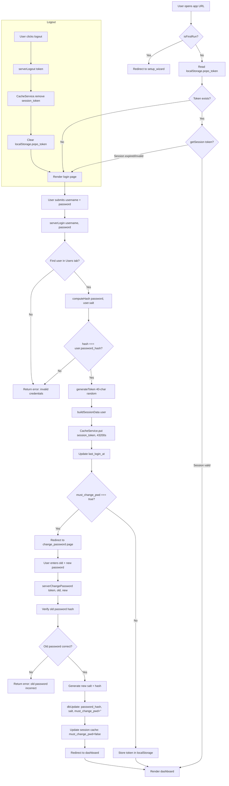
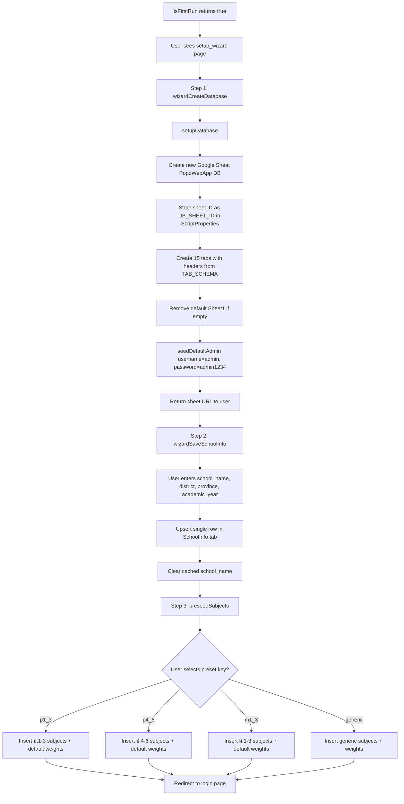
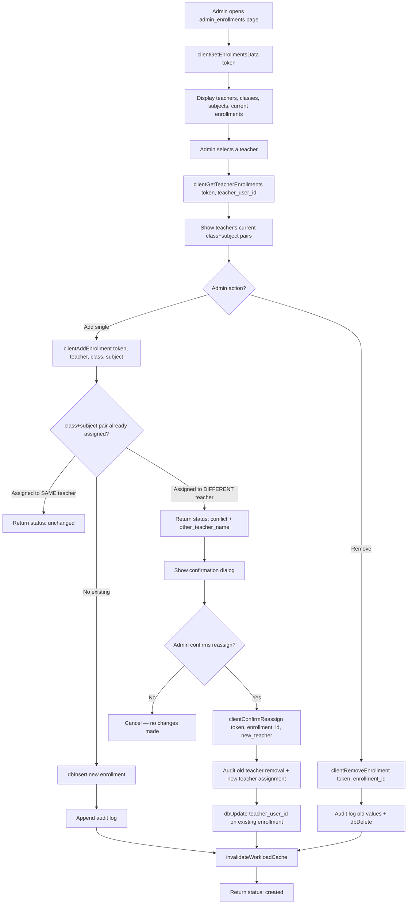
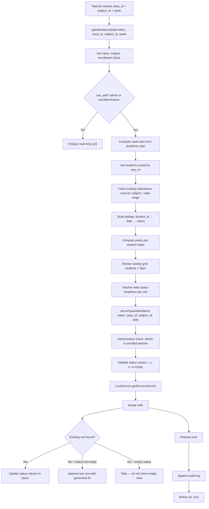
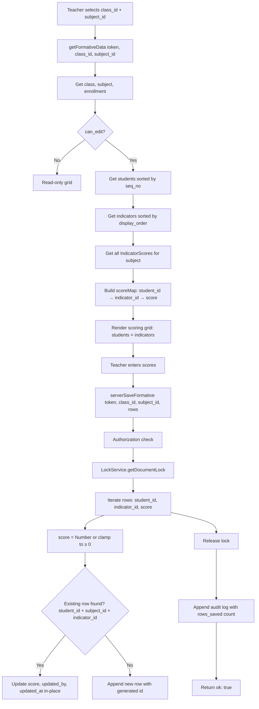
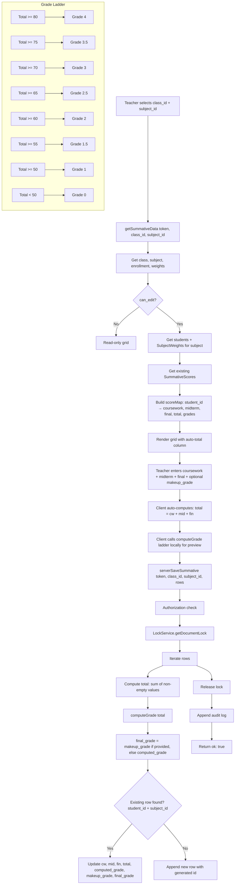
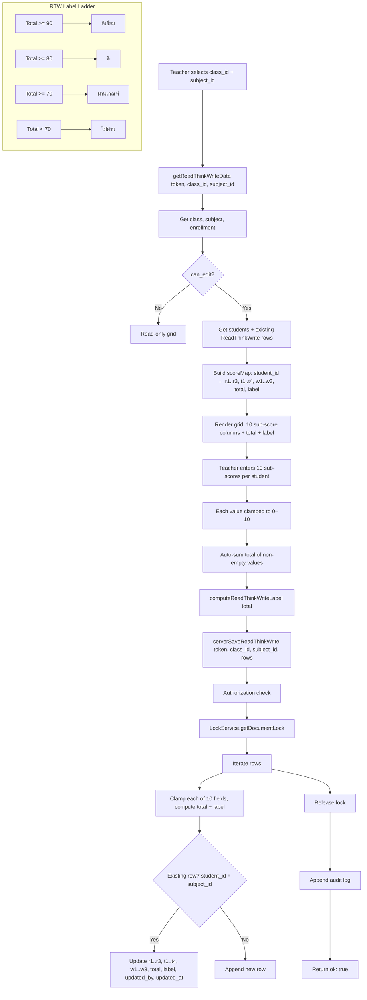
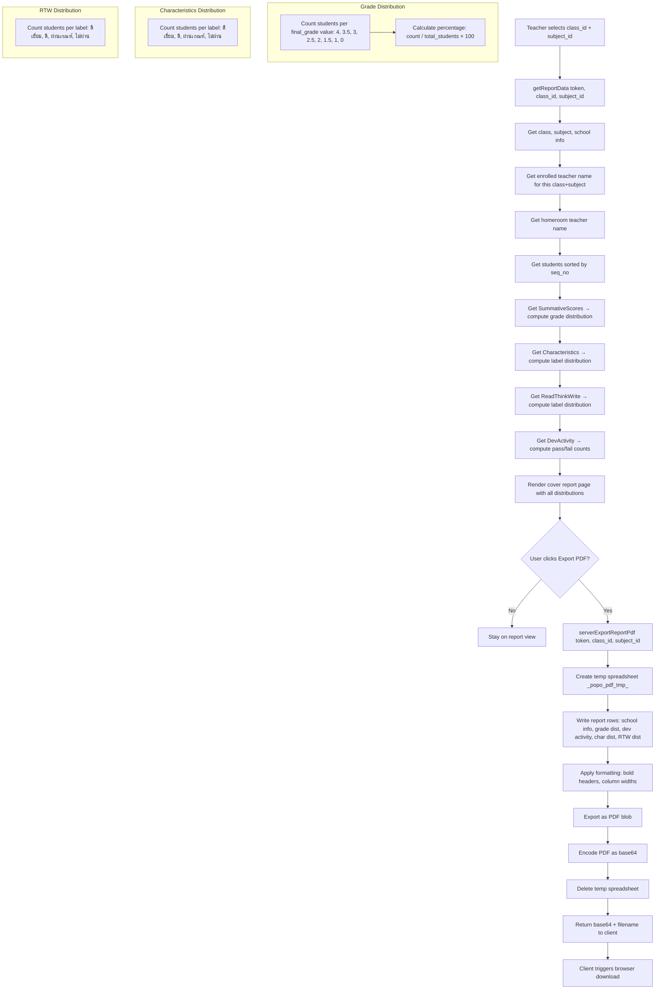
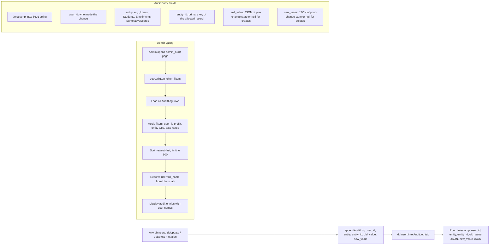

# 2.3 Process Design

> Process Design document for the **popoWebApp** Thai school grading system (ระบบจัดการ ป.พ.5 ออนไลน์).  
> Each section contains a Mermaid flowchart, a brief description, and key decision points.

---

## 1. Authentication & Login Flow

The authentication system manages user identity through session tokens stored in Google Apps Script's `CacheService` with a 12-hour TTL. Passwords are hashed using SHA-256 with per-user UUID salts. First-time teachers are forced to change their password via a `must_change_pwd` flag.



**Key decision points:**
- `isFirstRun()` checks `PropertiesService.getScriptProperties().getProperty('DB_SHEET_ID')` — if absent, the app has never been set up.
- Session expiry is checked client-side via `expires_at` in the cached session data; if `Date.now() > session.expires_at`, the session is invalidated server-side.
- New teachers created by admin always get `must_change_pwd: true`, forcing a password change on first login.

**Error handling:**
- Invalid credentials return a generic Thai error message to prevent user enumeration.
- `serverChangePassword` enforces a minimum 4-character password and validates the old password before proceeding.

---

## 2. First-Run Setup Wizard

The wizard guides a first-time administrator through database creation, school info entry, and subject pre-seeding. It is only accessible when `DB_SHEET_ID` is not yet stored in script properties.



**Key decision points:**
- `isFirstRun()` is a boolean gate: if `DB_SHEET_ID` is set, the wizard is inaccessible.
- `setupDatabase()` is idempotent — existing tabs are preserved; only missing tabs are created.
- The default admin (`admin/admin1234`) is seeded only when the `Users` tab has fewer than 2 rows.

**Error handling:**
- If `DB_SHEET_ID` is set but the spreadsheet cannot be opened, a descriptive error tells the admin to remove the stale property.
- Subject pre-seeding skips subjects whose IDs already exist (idempotent).

---

## 3. Admin: School & Class Management

Administrators manage school metadata, classes, subjects, and weight configurations. All mutations are admin-only and audited.

```mermaid
flowchart TD
    subgraph SchoolInfo
        A1[Admin opens admin_school page] --> A2[getSchoolInfo]
        A2 --> A3{SchoolInfo row exists?}
        A3 -- Yes --> A4[Display current school info]
        A3 -- No --> A4[Display empty form]
        A4 --> A5[Admin edits fields]
        A5 --> A6[serverSaveSchoolInfo token, fields]
        A6 --> A7[LockService.getDocumentLock]
        A7 --> A8[Upsert row 2 of SchoolInfo sheet]
        A8 --> A9[Clear school_name cache]
        A9 --> A10[Release lock]
    end

    subgraph Classes
        B1[Admin opens admin_classes page] --> B2[getClassesList token]
        B2 --> B3[Display classes with labels]
        B3 --> B4{Admin action?}
        B4 -- Add --> B5[serverAddClass token, level, section, teacher_id]
        B5 --> B6[generateClassId level, section]
        B6 --> B7{class_id already exists?}
        B7 -- Yes --> B8[Error: class already exists]
        B7 -- No --> B9[dbInsert Classes row]
        B4 -- Edit --> B10[serverUpdateClass token, class_id, fields]
        B10 --> B11[dbUpdate Classes row]
        B4 -- Delete --> B12[serverDeleteClass token, class_id]
        B12 --> B13[dbDelete Classes row]
        B4 -- CSV Import --> B14[serverImportClassesCSV token, rows]
        B14 --> B15[Parse + validate each row]
        B15 --> B16[Create or update classes with audit log]
    end

    subgraph Subjects
        C1[Admin opens admin_subjects page] --> C2[getSubjectsList token]
        C2 --> C3[Display subjects with class labels]
        C3 --> C4{Admin action?}
        C4 -- Add --> C5[serverAddSubject token, name, code, class_ids, etc.]
        C5 --> C6[Clone subject across multiple class_ids if specified]
        C6 --> C7[insertSubjectWeightsIfMissing for each new subject_id]
        C4 -- Edit --> C8[serverUpdateSubject token, subject_id, fields]
        C8 --> C9{weight_group changed?}
        C9 -- Yes --> C10[Update SubjectWeights to new default weights]
        C9 -- No --> C11[Skip weight sync]
        C4 -- Delete --> C12[serverDeleteSubject token, subject_id]
        C4 -- CSV Import --> C13[serverImportSubjectsCSV token, rows]
        C13 --> C14[Validate each row + weight sum = 100]
        C14 --> C15[Create auto-classes if needed]
        C15 --> C16[Upsert subjects + weights with audit]
    end

    subgraph Weights
        D1[Admin opens admin_weights page] --> D2[getWeightsList token]
        D2 --> D3[Display all weights joined with subject names]
        D3 --> D4[Admin edits weight values]
        D4 --> D5[serverSaveWeights token, rows]
        D5 --> D6{pre_mid + mid + post_mid + final_exam = 100?}
        D6 -- No --> D7[Error: weights must sum to 100]
        D6 -- Yes --> D8[LockService + upsert all weight rows]
    end
```



**Key decision points:**
- Subject creation supports multi-class cloning: a single `serverAddSubject` call can create the same subject for multiple classes.
- `serverSaveWeights` validates that `pre_mid_max + mid_max + post_mid_max + final_exam_max = 100` per row before writing anything.
- Subject CSV import auto-creates missing classes and validates weight sums per row.

**Error handling:**
- Duplicate class IDs return a Thai error message.
- Subject weight validation failures are reported with specific subject IDs.

---

## 4. Admin: Enrollment Assignment

The enrollment system uses a teacher-first flow where an admin selects a teacher first, then assigns class+subject pairs. Conflict detection prevents double-assignment, and a reassignment confirmation flow handles overriding existing assignments.



**Key decision points:**
- Conflict detection uses `(class_id, subject_id)` as a unique key — each class+subject pair can only have one teacher assigned.
- `invalidateWorkloadCache()` clears the cached workload data so the admin workload dashboard reflects changes immediately.

**Error handling:**
- Lock acquisition failure returns `"Could not acquire lock. Please try again."`
- Missing required fields return an error before any database operations.

---

## 5. Teacher: Attendance Recording (การเข้าเรียน)

Teachers record student attendance on a weekly grid. The system computes week dates from the academic year start (first Monday on or after May 13). Attendance status uses Thai markers: `/` (present), `ล` (leave), `ข` (absent), or empty (not recorded).



**Key decision points:**
- `getAcademicYearStart()` reads `SchoolInfo.academic_year`, converts Thai years (BE) to CE if needed, and finds the first Monday on or after May 13.
- Empty status values are skipped on insert — the system does not store blank attendance records.
- Yearly totals (`present`, `leave`, `absent`) are pre-computed server-side for display on the grid.

**Error handling:**
- Invalid status values are silently skipped (防御性 programming).
- Lock timeout (30s) throws `"ไม่สามารถบันทึกได้ กรุณาลองใหม่"`.

---

## 6. Teacher: Formative Scoring (คะแนน1)

Formative scoring records per-indicator scores for each student. Indicators are defined per subject and ordered by `display_order`.



**Key decision points:**
- Scores are clamped to non-negative (`score < 0` → `0`). Scores that are `NaN` are set to `0`.
- Upsert logic matches on `(student_id, subject_id, indicator_id)` triplet within the sheet data loaded into memory.
- The lock wraps the entire batch of row mutations to prevent interleaved writes from concurrent users.

---

## 7. Teacher: Summative Scoring (คะแนน2)

Summative scoring records coursework, midterm, and final exam scores. The total and grade are computed automatically using the `computeGrade()` ladder. An optional `makeup_grade` can override the computed grade.



**Key decision points:**
- Total is computed server-side as the sum of any non-empty score fields. If all three fields are filled, it's their sum; if some are partial, it sums whatever is present.
- `makeup_grade` overrides `computed_grade` to produce `final_grade` — used for students who take a makeup exam.
- Weight configuration (`SubjectWeights`) is loaded to display max score columns on the grid, but the actual score values are independent (teachers enter actual earned points, not percentages).

---

## 8. Teacher: Characteristics Scoring (คุณลักษณะ)

Characteristics scoring evaluates 8 traits (t1–t8) per student per subject. Each trait has a max of 10, yielding a total max of 80. A label is computed via `computeCharacteristicsLabel()`.

```mermaid
flowchart TD
    A[Teacher selects class_id + subject_id] --> B[getCharacteristicsData token, class_id, subject_id]
    B --> C[Get class, subject, enrollment]
    C --> D{can_edit?}
    D -- No --> E[Read-only grid]
    D -- Yes --> F[Get students + existing Characteristics rows]
    F --> G[Build scoreMap: student_id → t1..t8, total, label]
    G --> H[Render grid: students × 8 trait columns + total + label]

    H --> I[Teacher enters t1..t8 values per student]
    I --> J[Each value clamped to 0–10]
    J --> K[Auto-sum total of non-empty values]
    K --> L[computeCharacteristicsLabel total]

    L --> M[serverSaveCharacteristics token, class_id, subject_id, rows]
    M --> N[Authorization check]
    N --> O[LockService.getDocumentLock]
    O --> P[Iterate rows]
    P --> Q[Clamp values to 0–10, compute total + label]
    Q --> R{Existing row? student_id + subject_id}
    R -- Yes --> S[Update t1..t8, total, label, updated_by, updated_at]
    R -- No --> T[Append new row]
    P --> U[Release lock]
    U --> V[Append audit log]
    V --> W[Return ok: true]

    subgrade Characteristics Label Ladder
        X[Total >= 70] --> XL[ดีเยี่ยม]
        Y[Total >= 60] --> YL[ดี]
        Z2[Total >= 50] --> ZL[ผ่านเกณฑ์]
        AA2[Total < 50] --> AAL[ไม่ผ่าน]
    end
```

**Key decision points:**
- Each trait score is clamped to `Math.min(10, Math.max(0, Number(v)))` — invalid values become empty strings.
- If all 8 traits are empty, `total` is set to empty string and `label` is also empty (not recorded).
- The upsert matches on `(student_id, subject_id)`.

---

## 9. Teacher: Read-Think-Write Scoring (อ่าน-คิด-เขียน)

The Read-Think-Write assessment records 10 sub-scores: 3 reading (r1–r3), 4 thinking (t1–t4), and 3 writing (w1–w3). Each sub-score maxes at 10, yielding a total max of 100. A label is computed via `computeReadThinkWriteLabel()`.



**Key decision points:**
- The 10 sub-scores are divided into three domains: Reading (r1–r3), Thinking (t1–t4), and Writing (w1–w3). The grid groups them visually.
- Total is the sum of all non-empty sub-scores. If all are empty, total is blank and no label is assigned.
- The label thresholds differ from characteristics: 90+ → ดีเยี่ยม, 80+ → ดี, 70+ → ผ่านเกณฑ์, below 70 → ไม่ผ่าน.

---

## 10. Report Generation (ปก ป.พ.5)

The cover report aggregates data from multiple sheets to produce a summary page for a specific class+subject. It includes grade distribution, characteristics distribution, RTW distribution, and student development activity results. The PDF export creates a temporary spreadsheet, formats it, exports to PDF, then deletes the temp file.



**Key decision points:**
- The `dev_activity` result field uses Thai values: `ผ่าน` (pass), `ไม่ผ่าน` (fail), `ร` (participated), `มส` (not participating).
- Grade distribution shows all 8 grade levels regardless of whether any students received that grade (zeros are still shown).
- PDF export is done client-side — the server returns base64, and the client creates a download link.

**Error handling:**
- If the `DevActivity` tab does not exist yet, the report gracefully defaults all counts to zero.

---

## 11. Audit Trail

Every data mutation in the system calls `appendAuditLog()`, which inserts a row into the `AuditLog` sheet tab. The audit log is queryable by admins with filters for user, entity type, and date range.



**Key decision points:**
- `old_value` is `null` (JSON `null`) for inserts; `new_value` is `null` for deletes.
- For bulk operations (CSV imports, bulk assignments), the audit log records a single entry with aggregated metadata (e.g., `{ rows_imported: 5, created: 3, updated: 2 }`).
- The admin audit query limits results to 500 rows for performance.

**Error handling:**
- `getAuditLog` requires admin role — non-admins receive a permission error.
- Date filters add 1 day to `date_to` for inclusive end-of-day matching.

---

## 12. CSV Import Pattern

CSV import is shared across users, classes, and subjects. The pattern involves client-side CSV parsing, server-side validation, locking, and bulk upsert with audit logging.

```mermaid
flowchart TD
    A[Admin selects CSV file] --> B[Client: Parse CSV into array of objects]
    B --> C[Client: Validate header columns]
    C --> D[Client: Call serverImport[Entity]CSV token, rows]

    D --> E[Server: Verify admin role]
    E --> F[Server: Acquire LockService.getDocumentLock — 30s timeout]

    F --> G[Lock acquired?]
    G -- No --> H[Return error: lock timeout]

    G -- Yes --> I[Server: Load existing records into lookup maps]
    I --> J[Iterate rows]
    J --> K{Validate row}
    K -- Missing required fields --> L[Append warning + skip row]
    K -- Valid --> M{Match existing record?}
    M -- Match by ID or unique key --> N[dbUpdate with new values]
    M -- No match --> O[dbInsert with generated ID]
    N --> P[Append audit entry: old + new values]
    O --> Q[Append audit entry: null + new values]
    L --> J
    P --> J
    Q --> J

    J --> R[Release lock]
    R --> S[Return result: ok, success_count, created_count, updated_count, warnings]

    subgraph Entity-Specific Logic
        T[Users: password hashing for new users, must_change_pwd flag]
        U[Classes: auto-generate class_id from level+section, lookup teacher by username]
        V[Subjects: validate weight sums, auto-create missing classes, clone across classes]
        W[Students: citizen_id uniqueness check within class]
    end
```

**Key decision points:**
- All CSV imports run within `LockService.getDocumentLock()` to prevent concurrent writes from corrupting the sheet.
- Each row is independently validated. Invalid rows are skipped with a Thai-language warning message containing the row number.
- The return payload includes `warnings` (non-fatal issues), `created_count`, and `updated_count` for user feedback.

**Error handling:**
- If the lock cannot be acquired within 30 seconds, the operation fails with a user-friendly error.
- Row-level errors (e.g., missing required fields, duplicate citizen IDs) produce warnings but do not abort the entire import — processing continues for remaining rows.
- Subject CSV import validates that `pre_mid_max + mid_max + post_mid_max + final_exam_max = 100` per row if any weight is provided; invalid weight rows are skipped with a warning.
