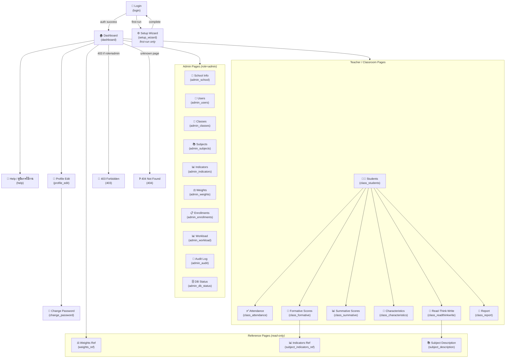

# 2.4 UI/UX Design Document

> **Project**: popoWebApp — ระบบจัดการ ป.พ.5 ออนไลน์ (Thai School Grading System)  
> **School**: โรงเรียนบ้านโพนแท่น, สพป.ร้อยเอ็ดเขต 2

---

## 1. Navigation Structure

### Fixed Top Navbar

The navbar is a `position: fixed` bar at the top of every authenticated page. It provides global navigation, identity feedback, and session-aware controls.

```
┌─────────────────────────────────────────────────────────────────────────┐
│ [🏠 Logo+Title]  จัดการผู้สอน  ภาระงานครู  จัดการผู้ใช้     [👤 Name ▾] │
│ ระบบจัดการ ป.พ.5 ออนไลน์                         ▸ แก้ไขโปรไฟล์    │
│ โรงเรียนบ้านโพนแท่น                              ▸ ──────────────  │
│  (admin-only links)                               ▸ ออกจากระบบ     │
└─────────────────────────────────────────────────────────────────────────┘
```

#### Structure & Behavior

| Element | Description |
|---|---|
| **Brand block** (`.navbar-title`) | School logo + two-line title: `ระบบจัดการ ป.พ.5 ออนไลน์` (title-text, 14.5px bold) and dynamic school name (subtitle-text, 11px, 75% opacity white). On page load, replaced from skeleton via `initNavbarAvatar()` which calls `serverGetCurrentUserProfile()` and injects the real school name. |
| **Admin-only links** | Three links visible only when `session.role === 'admin'`: จัดการผู้สอน (`admin_enrollments`), ภาระงานครู (`admin_workload`), จัดการผู้ใช้ (`admin_users`). Rendered via `<? if ?>` server-side conditional. |
| **User dropdown** (`.navbar-user`) | Right-aligned. Shows avatar (28×28px circle) + display name. If no avatar uploaded, shows initial letter in a `.navbar-avatar-placeholder` (28px circle, `rgba(255,255,255,0.2)` bg). Clicking toggles `.navbar-dropdown.open`. |
| **Dropdown menu** | White card overlay with: profile header (60px avatar + name + role badge), แก้ไขโปรไฟล์ link (→ `profile_edit`), divider, ออกจากระบบ link. Clicking outside closes it. |
| **Dynamic avatar injection** | `initNavbarAvatar()` (in `_styles.html`) fires on `DOMContentLoaded`. It calls `google.script.run.serverGetCurrentUserProfile(TOKEN)` and replaces skeleton placeholders with real avatar `` or initial letter, plus the full name. Also updates the dropdown profile header's avatar and role text (`ผู้ดูแลระบบ` for admin, `ครู` for teacher). |
| **Mobile** | At ≤640px: padding reduces to `0 12px`, link font-size drops to 12.5px, title font shrinks. |

#### Navbar CSS Properties

```css
.navbar {
  background: var(--brand);          /* #1a56a0 */
  color: white;
  padding: 0 20px;
  display: flex;
  align-items: center;
  gap: 4px;
  height: 52px;
  box-shadow: var(--shadow-nav);    /* 0 2px 8px rgba(0,0,0,0.15) */
  position: fixed;
  top: 0; left: 0; right: 0;
  z-index: 100;
}
body:has(.navbar) { padding-top: 52px; }
```

---

## 2. Page Hierarchy Diagram



---

## 3. Design System

### 3.1 Color Palette

All colors are defined as CSS custom properties on `:root` for consistent theming and easy overrides.

#### Brand Colors

| Variable | Hex | Usage |
|---|---|---|
| `--brand` | `#1a56a0` | Primary actions, navbar, headings, focus rings |
| `--brand-dark` | `#154880` | Hover states on brand elements |
| `--brand-light` | `#e8f0fe` | Light backgrounds, secondary buttons, badges |
| `--brand-hover` | `#f0f6ff` | Row hover in tables, step-card hover |

#### Semantic Colors

| Variable | Hex | Usage |
|---|---|---|
| `--green` | `#27ae60` | Success toasts, save buttons, "present" attendance |
| `--green-dark` | `#219150` | Hover state for green buttons |
| `--red` | `#e74c3c` | Danger buttons, error banners, validation errors |
| `--red-dark` | `#c0392b` | Error toast bg, "absent" attendance badge |
| `--amber` | `#f0a500` | Warning notices, makeup-input border |
| `--purple` | `#8e44ad` | PDF export buttons, characteristics card accent |

#### Neutral Colors

| Variable | Hex | Usage |
|---|---|---|
| `--text` | `#2d3748` | Primary body text |
| `--text-muted` | `#6b7280` | Labels, secondary info, placeholders |
| `--border` | `#e5e7eb` | Table borders, card outlines, input borders |
| `--border-focus` | `#1a56a0` | Input focus ring accent (same as brand) |

#### Background Colors

| Variable | Hex | Usage |
|---|---|---|
| `--bg-page` | `#f3f6fb` | Page background |
| `--bg-card` | `#ffffff` | Card surfaces |
| `--bg-table-head` | `#f0f4fa` | Table header row backgrounds |

#### Shadows

| Variable | Value | Usage |
|---|---|---|
| `--shadow-card` | `0 2px 10px rgba(26, 86, 160, 0.08)` | Card elevation |
| `--shadow-nav` | `0 2px 8px rgba(0, 0, 0, 0.15)` | Navbar elevation |

#### Border Radius

| Variable | Value | Usage |
|---|---|---|
| `--radius` | `8px` | Cards, modals, major containers |
| `--radius-sm` | `5px` | Buttons, inputs, badges, small elements |
| `--radius-pill` | `20px` | Role badges, user pills |

### 3.2 Typography

| Property | Value |
|---|---|
| **Primary font** | `'Sarabun', 'TH Sarabun New', sans-serif` — Thai-optimized web font loaded via Google Fonts (`wght@300;400;500;600;700`) |
| **Base size** | `15px` on `<body>` |
| **Line height** | `1.6` |
| **Anti-aliasing** | `-webkit-font-smoothing: antialiased` |

#### Type Scale (used throughout)

| Element | Size | Weight | Color |
|---|---|---|---|
| Page title (`h2.page-title`) | 20px | 600 | `--brand` |
| Card heading (`h2`) | 18px | 600 | `--brand` |
| Card sub-heading (`h3`) | 14.5px | 600 | `#444` |
| Section title (`.section-title`) | 15px | 700 | `--brand`, border-bottom: `2px solid --brand-light` |
| Navbar title (`.title-text`) | 14.5px | 700 | `#ffffff` |
| Navbar subtitle (`.subtitle-text`) | 11px | 400 | `rgba(255,255,255,0.75)` |
| Nav links | 13.5px | 400 | `rgba(255,255,255,0.88)` |
| Table body | 13.5px | — | `--text` |
| Table header | 13px | 600 | `#374151` |
| Labels | 12.5px | 500 | `--text-muted` |
| Badge text | 11–12px | 600 | varies by type |

### 3.3 Spacing & Layout Patterns

#### Container Widths

| Class | Max-width | Usage |
|---|---|---|
| `.container` | 1000px | Default content wrapper |
| `.container.wide` | 1200px | Wider tables, admin grids |
| `.container.narrow` | 720px | Login, profile forms |
| Dashboard container | 880px (inline) | Teacher pair cards |

#### Common Spacing

- Card padding: `24px` (mobile: `16px`)
- Card bottom margin: `20px`
- Container margin: `28px auto` (mobile: `16px auto`)
- Container side padding: `0 20px` (mobile: `0 12px`)
- Form group gap: `5px` (label-to-input)
- Form row gap: `10px`
- Input padding: `8px 11px`

#### Grid Patterns

| Pattern | CSS | Usage |
|---|---|---|
| Menu grid | `grid-template-columns: repeat(auto-fill, minmax(170px, 1fr))` | Admin quick links dashboard |
| Pair link grid | `grid-template-columns: repeat(auto-fill, minmax(155px, 1fr))` | Teacher classroom action links |
| Two-column | `grid-template-columns: 1fr 1fr` | Profile edit, form layouts |
| Info rows | `grid-template-columns: 1fr 1fr` | Two-col info display (mobile: `1fr`) |

### 3.4 Breakpoints & Responsive Behavior

| Breakpoint | Target |
|---|---|
| `≤640px` | Mobile — all responsive overrides apply |
| `>640px` | Desktop — default styles |

**Mobile adaptations (≤640px):**

- Navbar: padding `0 12px`, link font-size 12.5px, title shrinks
- Cards: padding reduces to `16px`
- `.form-row` switches to `flex-direction: column`
- `.form-group` gets `min-width: 100%`
- `.two-col` collapses to `grid-template-columns: 1fr`
- `.menu-grid` switches to `grid-template-columns: 1fr 1fr` (2-column)
- Table font-size drops to `12.5px`, padding `8px 8px`
- `.filter-row` goes vertical
- Modal narrows via `max-width: 94vw`

Every page includes: `<meta name="viewport" content="width=device-width, initial-scale=1.0">`

---

## 4. Component Patterns

### 4.1 Navbar

Already documented in Section 1. Key CSS:

```css
.navbar { height: 52px; position: fixed; z-index: 100; ... }
.navbar a { color: rgba(255,255,255,0.88); padding: 6px 10px; border-radius: 5px; ... }
.navbar-user-trigger { padding: 4px 8px; border-radius: 20px; ... }
.navbar-dropdown { min-width: 200px; box-shadow: 0 4px 16px rgba(0,0,0,0.15); ... }
```

### 4.2 Cards

```css
.card {
  background: #ffffff;                    /* --bg-card */
  border-radius: 8px;                     /* --radius */
  padding: 24px;
  margin-bottom: 20px;
  box-shadow: 0 2px 10px rgba(26,86,160,0.08);  /* --shadow-card */
  border: 1px solid rgba(26,86,160,0.06);
  overflow-x: auto;                       /* horizontal scroll for wide tables */
}
```

### 4.3 Data Tables

```css
table { width: 100%; border-collapse: collapse; font-size: 13.5px; }
thead th {
  background: #f0f4fa;           /* --bg-table-head */
  padding: 10px 12px;
  border-bottom: 2px solid #e5e7eb;  /* --border */
  font-weight: 600; color: #374151;
  white-space: nowrap;
}
tbody td { padding: 10px 12px; border-bottom: 1px solid #e5e7eb; }
tbody tr:hover td { background: #f0f6ff; }  /* --brand-hover */
tbody tr:last-child td { border-bottom: none; }

/* Dark header variant (audit log) */
thead.dark th { background: #1a56a0; color: white; border-bottom: none; }

/* Special columns */
td.total-col { font-weight: 700; color: #1a56a0; background: #f4f8ff; text-align: center; }
td.grade-col { font-weight: 700; color: #27ae60; background: #f0faf4; text-align: center; }
td.makeup-col { background: #fffaf0; text-align: center; }
td.seq-col { text-align: center; color: #6b7280; width: 36px; }
td.name-col { text-align: left; white-space: nowrap; }
td.label-col { font-weight: 700; background: #f1f8f1; text-align: center; }
```

### 4.4 Form Inputs

```css
input[type="text"], input[type="password"], input[type="number"],
input[type="date"], input[type="email"], select, textarea {
  padding: 8px 11px;
  border: 1.5px solid #e5e7eb;           /* --border */
  border-radius: 5px;                    /* --radius-sm */
  font-size: 13.5px;
  font-family: 'Sarabun', sans-serif;
  color: #2d3748;                         /* --text */
  background: white;
  transition: border-color 0.15s, box-shadow 0.15s;
}
input:focus, select:focus, textarea:focus {
  outline: none;
  border-color: #1a56a0;                 /* --border-focus */
  box-shadow: 0 0 0 3px rgba(26,86,160,0.1);
}
input.invalid, input:invalid { border-color: #e74c3c; }  /* --red */

.form-group { display: flex; flex-direction: column; gap: 5px; min-width: 130px; }
.form-group label { font-size: 12.5px; color: #6b7280; font-weight: 500; }
.form-row { display: flex; gap: 10px; flex-wrap: wrap; align-items: flex-end; }
```

### 4.5 Buttons

| Button class | Background | Text | Hover | Disabled |
|---|---|---|---|---|
| `.btn-primary` / `button.btn-primary` | `--brand` (#1a56a0) | white | `--brand-dark` (#154880) | `#93b8d8`, `not-allowed` |
| `.btn-secondary` | `--brand-light` (#e8f0fe) | `--brand` | `#d5e5f5` | `opacity: 0.5` |
| `.btn-danger` / `button.btn-danger` | `--red` (#e74c3c) | white | `--red-dark` (#c0392b) | — |
| `.btn-save` | `--green` (#27ae60) | white | `--green-dark` (#219150) | `#aaa`, `not-allowed` |
| `.btn-pdf` | `--purple` (#8e44ad) | white | `#7d3c98` | `#aaa`, `not-allowed` |
| `.login-btn` | `--brand` (#1a56a0) | white, 600 weight | `--brand-dark` | `#93b8d8` |

Common button base: `padding: 8px 18px; border: none; border-radius: 5px; font-size: 13.5px; font-family: inherit; cursor: pointer; font-weight: 500; display: inline-flex; align-items: center; gap: 6px;`

### 4.6 Toast Notifications

```css
.toast {
  position: fixed; top: 64px; right: 20px;
  padding: 12px 18px; border-radius: 8px;
  font-size: 13.5px; z-index: 9999;
  max-width: 340px;
  box-shadow: 0 4px 16px rgba(0,0,0,0.18);
  font-weight: 500;
  display: none;  /* toggled via JS */
}
.toast.success { background: #27ae60; color: white; }   /* --green */
.toast.error   { background: #c0392b; color: white; }    /* --red-dark */
```

### 4.7 Loading Skeletons

The skeleton system uses a single `@keyframes skeleton-pulse` animation:

```css
@keyframes skeleton-pulse {
  0% { opacity: 0.6; }
  50% { opacity: 1; }
  100% { opacity: 0.6; }
}
```

**Skeleton variants:**

| Class | Description |
|---|---|
| `.skeleton`, `.skeleton-fill` | Base animated block (`#e2e5e9` bg, 4px radius, 1.5s pulse) |
| `.skeleton-line` | Horizontal line (height: 14px), width variants: `.w20`–`.w100` |
| `.skeleton-block` | Taller block (height: 38px), for buttons/inputs |
| `.skeleton-badge` | Circular avatar placeholder (30px, `#d5dae0` bg) |
| `.skeleton-table` | Full table mockup with header and rows |
| `.skeleton-table.compact` | Shorter cells (32px) |
| `.skeleton-table.tall` | Taller cells (46px) |
| `.skeleton-table.two-tier` | Two-row header mockup |
| `.skeleton-card-grid` | Grid of placeholder cards (`minmax(180px, 1fr)`) |
| `.skeleton-card` | Individual card placeholder |
| `.skeleton-action-grid` | Action link grid (`minmax(155px, 1fr)`) |
| `.skeleton-action` | Single action link placeholder (height: 39px) |
| `.skeleton-form` / `.skeleton-form-row` / `.skeleton-field` | Form layout skeleton with label + input |
| `.skeleton-menu` | 3-column grid of menu placeholders |
| `.navbar-title-skeleton` | Two-line placeholder for navbar brand |
| `.navbar-user-skeleton` | Avatar + name placeholder in navbar |
| `.nav-loading` | Full-page overlay during navigation transitions |

### 4.8 Modal / Confirmation Dialogs

```css
.modal-overlay {
  position: fixed; top: 0; left: 0;
  width: 100%; height: 100%;
  background: rgba(0,0,0,0.45);
  display: none; align-items: center; justify-content: center;
  z-index: 500;
}
.modal-overlay.open { display: flex; }
.modal {
  background: white; border-radius: 8px;
  padding: 28px; width: 380px; max-width: 94vw;
  box-shadow: 0 8px 32px rgba(0,0,0,0.2);
}
.modal h3 { font-size: 16px; color: var(--brand); font-weight: 600; margin-bottom: 18px; }
.modal .form-group { margin-bottom: 14px; width: 100%; }
.modal-actions { display: flex; gap: 10px; margin-top: 18px; }
```

### 4.9 Pair Cards (Dashboard — Teacher View)

Each pair card represents one class+subject enrollment for the logged-in teacher:

```
┌──────────────────────────────────────────────────┐
│  ป.6/1 — คณิตศาสตร์                    25 คน   │
│ ┌────────────┐ ┌────────────┐ ┌────────────┐      │
│ │ ข้อมูลนักเรียน│ │ เช็คชื่อ    │ │ คะแนน1     │      │
│ │  (gray)    │ │  (green)   │ │ ตัวชี้วัด   │      │
│ └────────────┘ └────────────┘ └────────────┘      │
│ ┌────────────┐ ┌────────────┐ ┌────────────┐      │
│ │ คะแนน2     │ │ คุณลักษณะ  │ │ อ่านคิดเขียน │      │
│ │ ผลการเรียน  │ │  (purple)  │ │  (red)     │      │
│ └────────────┘ └────────────┘ └────────────┘      │
│ ┌────────────┐                                   │
│ │ รายงานผล   │                                   │
│ │ การเรียน   │                                   │
│ └────────────┘                                   │
└──────────────────────────────────────────────────┘
```

**CSS:**

```css
.pair-card { border: 1px solid var(--border); border-radius: 8px; padding: 16px; margin-bottom: 14px; background: #fafcff; }
.pair-card-header { display: flex; justify-content: space-between; align-items: center; margin-bottom: 12px; }
.pair-card-header h3 { font-size: 15px; color: var(--brand); margin: 0; }
.pair-card-header .student-count { font-size: 13px; color: var(--text-muted); }
.pair-links { display: grid; grid-template-columns: repeat(auto-fill, minmax(155px, 1fr)); gap: 8px; }
```

**Action link color coding:**

| Link | Class | Background | Text Color | Border |
|---|---|---|---|---|
| ข้อมูลนักเรียน | `.students` | `#f5f5f5` | `#555` | `rgba(85,85,85,0.15)` |
| เช็คชื่อ | `.attendance` | `#e8f8f0` | `#1a7a4a` | `rgba(26,122,74,0.15)` |
| คะแนน1 ตัวชี้วัด | `.formative` | `#fff8e1` | `#b8860b` | `rgba(184,134,11,0.15)` |
| คะแนน2 ผลการเรียน | `.summative` | `#e8f0fe` | `--brand` | `rgba(26,86,160,0.15)` |
| คุณลักษณะ | `.characteristics` | `#f3e8fe` | `#7b2d9e` | `rgba(123,45,158,0.15)` |
| อ่านคิดเขียน | `.readthinkwrite` | `#fef0e8` | `#c0392b` | `rgba(192,57,43,0.15)` |
| รายงานผลการเรียน | `.report` | `#e8f4ec` | `#1a7a4a` | `rgba(26,122,74,0.15)` |

### 4.10 Step Cards (Dashboard — Admin View)

```css
.step-card {
  display: flex; align-items: center; gap: 16px;
  padding: 16px 20px; background: var(--bg-card);
  border: 1px solid var(--border); border-radius: 8px;
  cursor: pointer; text-decoration: none; color: inherit;
  transition: border-color 0.15s, background-color 0.15s, transform 0.15s, box-shadow 0.15s;
}
.step-card:hover { background-color: var(--brand-hover); border-color: var(--brand); transform: translateX(4px); box-shadow: 0 4px 12px rgba(26,86,160,0.06); }
.step-badge {
  width: 32px; height: 32px; border-radius: 50%;
  background: var(--brand); color: white;
  font-size: 15px; font-weight: 700;
  display: flex; align-items: center; justify-content: center; flex-shrink: 0;
  box-shadow: 0 2px 6px rgba(26,86,160,0.25);
}
.step-card:hover .step-badge { background: var(--brand-dark); transform: scale(1.05); }
```

### 4.11 Scoring Grids

Editable score inputs used in formative, summative, characteristics, and RTW pages:

```css
input.score-input {
  width: 40px; text-align: center;
  border: 1.5px solid var(--border); border-radius: 4px;
  padding: 3px 2px; font-size: 13px; font-family: inherit;
}
input.score-input:focus { border-color: var(--brand); outline: none; box-shadow: 0 0 0 2px rgba(26,86,160,0.12); }

input.makeup-input {
  width: 52px; text-align: center;
  border: 1.5px solid var(--amber); border-radius: 4px;
  padding: 3px 2px; font-size: 13px; font-family: inherit;
  background: #fffaf0;
}
input.makeup-input:focus { border-color: #e67e22; outline: none; }
```

### 4.12 Attendance Cells

```css
.att-cell {
  display: inline-flex; align-items: center; justify-content: center;
  width: 32px; height: 28px; border-radius: 4px;
  font-size: 14px; font-weight: 700; cursor: pointer; user-select: none;
  transition: background 0.12s;
}
.att-cell.status-slash { background: #d4edda; color: #1a7a1a; }  /* ✅ Present */
.att-cell.status-la    { background: #fff3cd; color: #856404; }  /* ⏰ Late */
.att-cell.status-kho   { background: #f8d7da; color: #721c24; }  /* ❌ Absent */
.att-cell.status-empty { background: #f0f0f0; color: #ccc; }    /* ⊘ Not taken */
```

### 4.13 Badges

```css
.role-badge { padding: 3px 10px; border-radius: 20px; font-size: 12px; font-weight: 600; display: inline-block; }
.role-badge.admin { background: #e8f0fe; color: #1a56a0; }
.role-badge.teacher { background: #eafaf1; color: #27ae60; }
.entity-badge { padding: 2px 8px; border-radius: 20px; font-size: 11px; background: #dbeafe; color: #1e40af; }
.badge-count { background: var(--brand); color: white; border-radius: 20px; padding: 2px 8px; font-size: 12px; }
```

**Grade scale badges:**

| Class | Background | Text |
|---|---|---|
| `.badge-4` | `#27ae60` | white |
| `.badge-35` | `#2ecc71` | white |
| `.badge-3` | `#3498db` | white |
| `.badge-2` | `#f39c12` | white |
| `.badge-1` | `#e67e22` | white |
| `.badge-0` | `--red-dark` | white |
| `.badge-diyiam` | `#27ae60` | white |
| `.badge-di` | `#3498db` | white |
| `.badge-pass` | `#f39c12` | white |
| `.badge-fail` | `--red-dark` | white |

### 4.14 Week Navigation (Attendance)

```css
.week-nav { display: flex; align-items: center; gap: 10px; margin-bottom: 16px; flex-wrap: wrap; }
.week-nav button { padding: 6px 16px; background: var(--brand); color: white; ... }
.week-label { font-size: 14px; font-weight: 700; color: var(--brand); }
```

### 4.15 Attendance Legend

```css
.legend { display: flex; gap: 14px; font-size: 12.5px; color: var(--text-muted); align-items: center; margin-bottom: 12px; flex-wrap: wrap; }
.legend-box { width: 20px; height: 20px; border-radius: 3px; display: inline-block; }
.legend-box.slash { background: #d4edda; }   /* Present */
.legend-box.la { background: #fff3cd; }      /* Late */
.legend-box.kho { background: #f8d7da; }     /* Absent */
.legend-box.empty { background: #f0f0f0; border: 1px solid var(--border); }
```

### 4.16 Filter Row (Audit)

```css
.filter-row { display: flex; flex-wrap: wrap; gap: 12px; align-items: flex-end; margin-bottom: 20px; }
.filter-group { display: flex; flex-direction: column; gap: 4px; }
.filter-group label { font-size: 12.5px; color: var(--text-muted); font-weight: 500; }
```

### 4.17 Back Button

```css
.back-btn {
  display: inline-flex; align-items: center; gap: 5px;
  padding: 4px 0; background: none; color: var(--brand);
  border: none; border-radius: 5px; font-size: 13px;
  font-family: inherit; cursor: pointer; text-decoration: none; font-weight: 500;
  margin-bottom: 14px;
}
```

## 5. Page Layout Descriptions

### 5.1 Login Page

```
┌────────────────────────────────────────────┐
│          background: linear-gradient        │
│          (180deg, #f6f9fe → #eef4fb)       │
│                                            │
│         ┌──────────────────────┐           │
│         │     🏫 [base64 PNG]   │           │
│         │   ระบบจัดการ ปพ.5    │           │
│         │      ออนไลน์         │           │
│         │                      │           │
│         │ โรงเรียนบ้านโพนแท่น   │           │
│         │ สพป.ร้อยเอ็ดเขต 2   │           │
│         │                      │           │
│         │ [❗ Error banner]     │           │
│         │                      │           │
│         │ ชื่อผู้ใช้ (Username) │           │
│         │ ┌──────────────────┐ │           │
│         │ │                  │ │           │
│         │ └──────────────────┘ │           │
│         │ รหัสผ่าน (Password)  │           │
│         │ ┌──────────────────┐ │           │
│         │ │                  │ │           │
│         │ └──────────────────┘ │           │
│         │                      │           │
│         │ [    เข้าสู่ระบบ    ] │           │
│         └──────────────────────┘           │
│                                            │
└────────────────────────────────────────────┘
```

**Key styling:**

- Card: `border-radius: 18px`, `box-shadow: 0 18px 50px rgba(26,86,160,0.14)`, `width: min(440px, calc(100vw - 32px))`
- Logo: 96×96px embedded base64 PNG (school emblem)
- Error banner: `#fdecea` bg, `--red-dark` text, `border-left: 3px solid --red`, hidden by default (`.error`), shown via `.error.show`
- Login button: full-width, `padding: 11px`, `border-radius: 6px`, `font-weight: 600`
- Skeleton loading screen (`#loginChecking`): full-viewport overlay with animated skeleton lines during token validation

**Auth flow:** On load, checks `localStorage.popo_token` → if present, calls `getPageHtml()` or `getPageHtmlWithParams()` with skeleton overlay → on success, `document.write()` replaces page → on failure, removes token and shows login form. Enter key triggers `doLogin()`.

### 5.2 Dashboard

**Admin view** shows:
1. **Section heading**: "ขั้นตอนการจัดการข้อมูลระบบ" (border-bottom: `2px solid --brand-light`)
2. **9 step cards** (`.step-card`) in a vertical stack (`.admin-setup-steps`), each with:
   - Numbered badge (`.step-badge`, 32px circle)
   - Title (14px, 600 weight) + description (12.5px, muted)
   - Hover effect: `translateX(4px)` shift, border-color → brand, bg → brand-hover
   - Arrow (➔) that transforms on hover
3. **General management heading** + `.menu-grid` with links to admin_school, help, weights_ref

**Teacher view** shows:
1. Welcome heading: "ยินดีต้อนรับ, {full_name}"
2. Section heading: "รายวิชาที่สอน"
3. Loading skeleton → replaced by pair cards via `loadTeacherClasses()` → `clientGetTeacherOwnClasses()`

### 5.3 Admin Pages (CRUD Pattern)

All admin CRUD pages follow the same layout structure:

```
┌─ Container (.container or .container.wide) ─────────────────────────┐
│ ┌─ Card ───────────────────────────────────────────────────────────┐ │
│ │ ← ย้อนกลับ                                                       │ │
│ │ h2: Page Title                                                   │ │
│ │ ┌─ Action Bar ─────────────────────────────────────────────┐     │ │
│ │ │ [+ เพิ่มรายการ]  [📥 นำเข้า CSV]                         │     │ │
│ │ └───────────────────────────────────────────────────────────┘     │ │
│ │ ┌─ Data Table ──────────────────────────────────────────────┐     │ │
│ │ │ Header | Header | Header | ... | จัดการ                  │     │ │
│ │ │────────────────────────────────────────────────────────── │     │ │
│ │ │ Row 1  | Value  | Value  | ... | [✏️] [🗑️]              │     │ │
│ │ │ Row 2  | Value  | Value  | ... | [✏️] [🗑️]              │     │ │
│ │ └───────────────────────────────────────────────────────────┘     │ │
│ └──────────────────────────────────────────────────────────────────┘ │
└──────────────────────────────────────────────────────────────────────┘
```

- **Action bar**: Flex row with primary "add" button and optional CSV import button
- **Data table**: Striped rows, sticky header with `--bg-table-head`, inline edit/delete actions
- **Add/Edit modal**: `.modal-overlay` with `.modal` card containing form groups and action buttons

### 5.4 Admin Enrollment Page

Two-panel layout:
1. **Left panel**: Teacher selection dropdown — populates class+subject matrix for the selected teacher
2. **Right panel**: Pair management table showing assigned classes and subjects for the teacher
3. **Conflict resolution**: When enrolling a teacher to a class+subject already assigned to another teacher, a confirmation dialog displays the current teacher's name and asks for reassignment confirmation

### 5.5 Admin Workload Page

Teacher workload cards sorted by `pair_count` descending. Each card shows:
- Teacher name + role badge
- Number of class+subject pairs
- Expandable drill-down panel (`.drill-panel`) listing all pairs with links

```css
.drill-panel { background: #f9fafb; border: 1px solid var(--border); border-radius: 8px; padding: 18px; margin-top: 20px; display: none; }
.drill-panel.open { display: block; }
```

### 5.6 Classroom Scoring Pages

Shared layout across formative, summative, characteristics, and RTW pages:

```
┌─ Container ──────────────────────────────────────────────────┐
│ ← ย้อนกลับ                                                    │
│ ┌─ Header Card ───────────────────────────────────────────┐   │
│ │ h2: ป.6/1 — คณิตศาสตร์                               │   │
│ │ [อ้างอิง: ตัวชี้วัด] [อ้างอิง: น้ำหนัก]                  │   │
│ └─────────────────────────────────────────────────────────┘   │
│ ┌─ Scoring Card ──────────────────────────────────────────┐   │
│ │ Table: students × scoring fields                        │   │
│ │ ┌────┬──────────┬──────┬──────┬─────┬───────┬───────┐  │   │
│ │ │ เล│ ชื่อ-สกุล │ คะแนน│ คะแนน│ ...│ รวม   │ เกรด │  │   │
│ │ │ ท │          │ 1    │ 2    │    │       │       │  │   │
│ │ ├────┼──────────┼──────┼──────┼─────┼───────┼───────┤  │   │
│ │ │ 1 │ นาย...   │ [40] │ [35] │ ... │ 75    │ 3.5   │  │   │
│ │ │ 2 │ นาย...   │ [30] │ [28] │ ... │ 58    │ 2     │  │   │
│ │ └────┴──────────┴──────┴──────┴─────┴───────┴───────┘  │   │
│ │ [💾 บันทึก]                                            │   │
│ └─────────────────────────────────────────────────────────┘   │
└───────────────────────────────────────────────────────────────┘
```

- Score inputs use `.score-input` (40px wide, centered)
- Makeup score inputs use `.makeup-input` (52px wide, amber border, cream bg)
- Total columns use `.total-col` styling (brand color, bold, centered)
- Grade columns use `.grade-col` (green color, bold, centered)
- Label columns use `.label-col` with contextual colors (diyiam=green, di=blue, pass=amber, fail=red)

### 5.7 Attendance Page

```
┌─ Header Card ────────────────────────────────────────────┐
│ h2: ป.6/1 — คณิตศาสตร์                                │
│ [← สัปดาห์ที่ 1]  สัปดาห์ที่ 1  [สัปดาห์ที่ 2 →]          │
│ Legend: ✅ มา  ⏰ มาสาย  ❌ ขาด  ⊘ ยังไม่เช็ค         │
└──────────────────────────────────────────────────────────┘
┌─ Attendance Table ───────────────────────────────────────┐
│ เลขที่ │ ชื่อ-สกุล │ วันจันทร์ │ วันอังคาร │ ... │ Σ │
│ 1      │ นาย...    │ [/]       │ [ล]       │ ... │ 3 │
│ 2      │ นาย...    │ [/]       │ [/]       │ ... │ 5 │
└──────────────────────────────────────────────────────────┘
```

- Week navigation: `.week-nav` with prev/next buttons and `.week-label`
- Legend: `.legend` row with colored `.legend-box` squares
- Attendance cells: `.att-cell` toggles on click through `/` → `ล` → `ข` → empty cycle
- Summary column at right with `Σ` total

### 5.8 Report Page

Cover data card showing:
- School name, class, subject, teacher
- Aggregated statistics (total students, averages, grade distribution)
- Export to PDF button (`.btn-pdf`, purple themed)

### 5.9 Reference Pages

Read-only tables:
- **Weights reference** (`weights_ref`): Displays `SubjectWeights` data
- **Indicators reference** (`subject_indicators_ref`): Displays `Indicators` for a given subject
- **Subject description** (`subject_description`): Displays subject metadata

All use `.readonly-notice` banner: `font-size: 13px; color: #78350f; background: #fffbeb; border-left: 4px solid --amber`

### 5.10 Profile Edit Page

- Centered narrow card (`.container.narrow`)
- Avatar upload area with circular preview (60px)
- Name fields (prefix, first name, surname)
- Upload button triggers `uploadAvatar()` — validates file size ≤ ~350KB, reads as base64, calls `serverUploadAvatar()`
- Link to change password page
- Save button triggers server-side profile update

---

## 6. Key UX Patterns

### 6.1 SPA-like Navigation

Navigation between pages uses `google.script.run` RPC calls rather than full page reloads:

```javascript
function navigate(page) {
  showNavLoading();  // Full-viewport skeleton overlay
  google.script.run
    .withSuccessHandler(function(html) {
      document.open();
      document.write(html);
      document.close();
    })
    .withFailureHandler(function(err) {
      hideNavLoading();
      alert('เกิดข้อผิดพลาด: ' + err.message);
    })
    .getPageHtml(TOKEN, page);
}
```

For pages requiring `class_id` and `subject_id` parameters:

```javascript
function goPage(page, classId, subjectId) {
  showNavLoading();
  google.script.run
    .withSuccessHandler(function(html) { document.open(); document.write(html); document.close(); })
    .withFailureHandler(function(err) { hideNavLoading(); alert(...); })
    .getPageHtmlWithParams(TOKEN, page, classId, subjectId);
}
```

### 6.2 Session Management

1. On page load, check `localStorage.popo_token`
2. If token exists, validate via `getSession()` server call
3. If session is invalid/expired → clear `localStorage.popo_token` → redirect to login
4. If `session.must_change_pwd === true` → force redirect to `change_password` page
5. Token is stored on every page via `var TOKEN = '<?= data.token ?>'; if (TOKEN) localStorage.setItem('popo_token', TOKEN);`

### 6.3 Skeleton Loading Pattern

Every page that makes async calls shows skeleton placeholders while data loads, then replaces with real content:

```javascript
// Show skeleton, hide real content
var welcomeSk = document.getElementById('welcomeSkeleton');
var sk = document.getElementById('dashSkeleton');
var ct = document.getElementById('dashContent');
// After data loads:
if (welcomeSk) welcomeSk.style.display = 'none';
if (sk) sk.style.display = 'none';
if (ct) ct.style.display = 'block';
```

The `showNavLoading()` / `hideNavLoading()` functions manage a full-viewport overlay skeleton during page transitions.

### 6.4 Toast Alerts

Functions `showToast(message, type)` are defined per-page (not in `_styles.html`). Pattern:

```javascript
function showToast(msg, type) {
  var toast = document.getElementById('toast');
  toast.textContent = msg;
  toast.className = 'toast ' + (type || 'success');
  toast.style.display = 'block';
  setTimeout(function() { toast.style.display = 'none'; }, 3000);
}
```

Used after save operations: `showToast('บันทึกสำเร็จ', 'success')` or `showToast('เกิดข้อผิดพลาด', 'error')`.

### 6.5 Must-Change-Password Flow

If the server returns `session.must_change_pwd === true` after login, the client automatically redirects:

```javascript
if (result.session && result.session.must_change_pwd) {
  google.script.run
    .withSuccessHandler(function(html) { document.open(); document.write(html); document.close(); })
    .getChangePasswordHtml(result.token);
}
```

### 6.6 CSV Import Pattern

Admin pages for classes, subjects, and students support CSV import:

1. File `<input type="file" accept=".csv">` triggers client-side CSV parse
2. Preview table shown in a modal with parsed data
3. User confirms → `google.script.run.serverBulkImportClassData()` / similar
4. Server validates row-by-row, returns warnings for skipped rows
5. Warnings displayed in an inline notice within the modal

### 6.7 Conflict Resolution (Enrollment Reassignment)

When an admin tries to enroll a teacher to a class+subject that already has a teacher:

1. Server response includes `{ conflict: true, existing_teacher: "ครูเดิม" }`
2. Client shows confirmation dialog: "รายวิชานี้มีครูผู้สอนคือ {existing_teacher} แล้ว ต้องการเปลี่ยนผู้สอนหรือไม่?"
3. If user confirms → `handleConfirmReassign()` sends the reassignment

### 6.8 Dynamic Navbar Avatar Injection

The `initNavbarAvatar()` function in `_styles.html`:

1. On `DOMContentLoaded`, replaces navbar brand and user sections with skeleton placeholders
2. Calls `google.script.run.serverGetCurrentUserProfile(TOKEN)`
3. On success, injects:
   - School name into `.navbar-title .subtitle-text`
   - Avatar image or initial-letter placeholder into `.navbar-user-trigger`
   - Name with optional "(admin)" suffix
4. On failure, calls `restoreNavbarDefaults()` to show fallback "ระบบจัดการ ปพ.5 ออนไลน์" and "ผู้ใช้งาน" placeholder

### 6.9 Back Button Injection

`injectBackBtn()` runs on every page and prepends a `.back-btn` (← ย้อนกลับ) before the `<h2>` element, except on the dashboard page (title contains "หน้าหลัก").

---

## 7. Responsive Design Considerations

### 7.1 Viewport Meta Tag

Every page includes:
```html
<meta name="viewport" content="width=device-width, initial-scale=1.0">
```

### 7.2 Mobile Breakpoint

A single `@media (max-width: 640px)` breakpoint handles all responsive adjustments:

| Element | Desktop | Mobile |
|---|---|---|
| Navbar padding | `0 20px` | `0 12px` |
| Navbar links | `13.5px`, `6px 10px` padding | `12.5px`, `4px 6px` padding |
| Navbar title | `14.5px` / `11px` | `13px` / `9.5px` |
| Container | `28px auto`, `0 20px` | `16px auto`, `0 12px` |
| Card padding | `24px` | `16px` |
| Form layout | `.form-row` flex row | flex column, `min-width: 100%` |
| Two-column layout | `1fr 1fr` grid | `1fr` single column |
| Menu grid | `minmax(170px, 1fr)` | `1fr 1fr` (2 columns) |
| Table | `13.5px` font, `10px 12px` padding | `12.5px` font, `8px 8px` padding |
| Filter row | flex row | flex column |
| Modal | `380px` width | `max-width: 94vw` |

### 7.3 Touch-Friendly Targets

- All buttons use `padding: 8px 18px` minimum (minimum ~44×36px touch target)
- Pair links: `padding: 10px 12px`
- Attendance cells: `32px × 28px` with cursor pointer
- Dropdown items: `padding: 10px 16px`

### 7.4 Score Grid Flexibility

Scoring grids use `grid-template-columns: repeat(auto-fill, minmax(155px, 1fr))` for the pair-links grid, ensuring columns wrap naturally on narrow screens while maintaining minimum readability.

### 7.5 Horizontal Table Scroll

All `.card` elements have `overflow-x: auto`, allowing wide scoring tables to scroll horizontally on mobile without breaking layout.

### 7.6 Skeleton Navigation Overlay

The `nav-loading` class provides a full-viewport overlay (`position: fixed; inset: 0; z-index: 10000`) that blocks interaction during page transitions, ensuring that touch events during navigation don't accidentally trigger unintended actions.