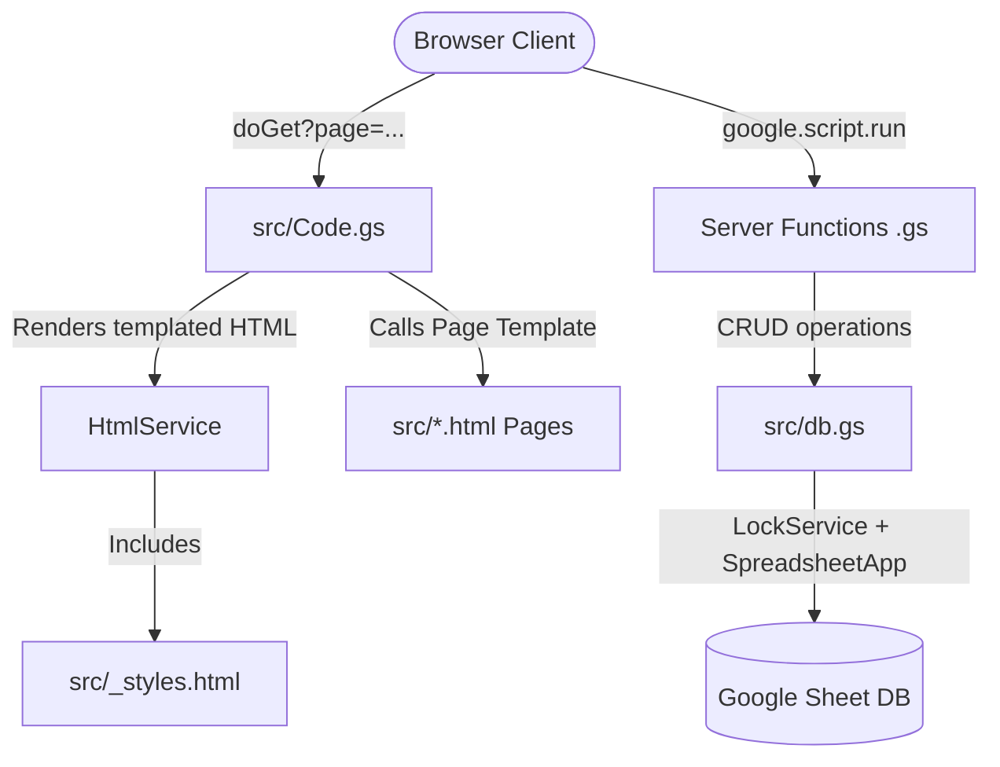

# AGENTS.md

## System Architecture

The application is structured as a Google Apps Script (GAS) web app with a Google Sheet functioning as a relational database. It serves server-rendered HTML pages containing client-side logic. There is no build/transpilation step; source files inside `src/` are pushed directly to Google Apps Script using `clasp`.



### Core Components
- **Entry point**: [Code.gs](file:///C:/Users/saich/Documents/popoWebApp/src/Code.gs) handles routing via `doGet(e)` based on the `?page=` query parameter.
- **Database Engine**: [db.gs](file:///C:/Users/saich/Documents/popoWebApp/src/db.gs) handles all CRUD operations on Google Sheets. It wraps all mutations in `LockService.getDocumentLock()` (with a 30s timeout) to prevent write conflicts.
- **Session & Auth**: [auth.gs](file:///C:/Users/saich/Documents/popoWebApp/src/auth.gs) manages session lifecycle. Sessions are cached in `CacheService.getScriptCache()` (12h expiration TTL), and session tokens are stored in the client's `localStorage` as `popo_token`.
- **Global Design & Utility System**: [_styles.html](file:///C:/Users/saich/Documents/popoWebApp/src/_styles.html) is embedded in every template via `<?!= include('_styles') ?>`. It contains all CSS styles, Tailwind configuration alternatives, toast alerts, loading states, navigation handlers, and dynamic user avatar rendering.

---

## Workspace File Structure

### Client & Server Code (`src/`)

The application is divided into server-side controllers (`.gs`) and client-side page views (`.html`).

#### Server-Side Core Controllers (`src/*.gs`)
- [Code.gs](file:///C:/Users/saich/Documents/popoWebApp/src/Code.gs): Page routers, authentication filters, and server evaluation utilities.
- [db.gs](file:///C:/Users/saich/Documents/popoWebApp/src/db.gs): Thin Sheets database CRUD interface with concurrency locking.
- [auth.gs](file:///C:/Users/saich/Documents/popoWebApp/src/auth.gs): Password cryptography (SHA-256 with per-user UUID salts), user provisioning, profile edits, and file/avatar uploads.
- [admin_school_api.gs](file:///C:/Users/saich/Documents/popoWebApp/src/admin_school_api.gs): Backend management for school parameters, courses, and classes.
- [admin_workload_api.gs](file:///C:/Users/saich/Documents/popoWebApp/src/admin_workload_api.gs): Dashboard aggregator that monitors and displays teacher teaching loads.
- [students.gs](file:///C:/Users/saich/Documents/popoWebApp/src/students.gs): Student roster CRUD database mutations.
- [enrollments.gs](file:///C:/Users/saich/Documents/popoWebApp/src/enrollments.gs): Subject-to-teacher mapping logic and validation.
- [indicators.gs](file:///C:/Users/saich/Documents/popoWebApp/src/indicators.gs): Evaluative indicators metadata store queries.
- [attendance.gs](file:///C:/Users/saich/Documents/popoWebApp/src/attendance.gs): Concurrency-safe student attendance tracking.
- [formative.gs](file:///C:/Users/saich/Documents/popoWebApp/src/formative.gs): Formative scoring grid read/write operations.
- [summative.gs](file:///C:/Users/saich/Documents/popoWebApp/src/summative.gs): Semester score management and Thai grading calculations.
- [characteristics.gs](file:///C:/Users/saich/Documents/popoWebApp/src/characteristics.gs): Affective features score records.
- [readthinkwrite.gs](file:///C:/Users/saich/Documents/popoWebApp/src/readthinkwrite.gs): Core text reading, critical thinking, and written comprehension records.
- [report.gs](file:///C:/Users/saich/Documents/popoWebApp/src/report.gs): Layout replication code copying data into a spreadsheet template to export print-ready PDFs.
- [setup.gs](file:///C:/Users/saich/Documents/popoWebApp/src/setup.gs) & [wizard.gs](file:///C:/Users/saich/Documents/popoWebApp/src/wizard.gs): First-run database schema installation and initial admin registration.
- [audit.gs](file:///C:/Users/saich/Documents/popoWebApp/src/audit.gs): Operations log tracker.
- [testapi.gs](file:///C:/Users/saich/Documents/popoWebApp/src/testapi.gs): API interface exposed exclusively during local testing for remote mock generation.

#### Client Views (`src/*.html`)
- [_styles.html](file:///C:/Users/saich/Documents/popoWebApp/src/_styles.html): Global layouts, design system variables, and DOM scripts.
- [login.html](file:///C:/Users/saich/Documents/popoWebApp/src/login.html): Credentials entry.
- [change_password.html](file:///C:/Users/saich/Documents/popoWebApp/src/change_password.html): User-initiated credential updates.
- [dashboard.html](file:///C:/Users/saich/Documents/popoWebApp/src/dashboard.html): Main hub for teachers and admin features.
- [profile_edit.html](file:///C:/Users/saich/Documents/popoWebApp/src/profile_edit.html): Profile configuration and avatar updates.
- [setup_wizard.html](file:///C:/Users/saich/Documents/popoWebApp/src/setup_wizard.html): First-run step-by-step installation instructions.
- [help.html](file:///C:/Users/saich/Documents/popoWebApp/src/help.html): Comprehensive user manual in Thai.
- **Admin Interfaces**:
  - [admin_school.html](file:///C:/Users/saich/Documents/popoWebApp/src/admin_school.html): School metadata.
  - [admin_users.html](file:///C:/Users/saich/Documents/popoWebApp/src/admin_users.html): User registry.
  - [admin_classes.html](file:///C:/Users/saich/Documents/popoWebApp/src/admin_classes.html): Classroom definitions.
  - [admin_subjects.html](file:///C:/Users/saich/Documents/popoWebApp/src/admin_subjects.html): Subject catalog.
  - [admin_indicators.html](file:///C:/Users/saich/Documents/popoWebApp/src/admin_indicators.html): Curriculum indicators catalog.
  - [admin_weights.html](file:///C:/Users/saich/Documents/popoWebApp/src/admin_weights.html): Max point splits configuration.
  - [admin_enrollments.html](file:///C:/Users/saich/Documents/popoWebApp/src/admin_enrollments.html): Teacher-course scheduler.
  - [admin_workload.html](file:///C:/Users/saich/Documents/popoWebApp/src/admin_workload.html): Teacher workload analytics.
  - [admin_audit.html](file:///C:/Users/saich/Documents/popoWebApp/src/admin_audit.html): Activity audit explorer.
  - [admin_db_status.html](file:///C:/Users/saich/Documents/popoWebApp/src/admin_db_status.html): Database diagnostics view.
- **Classroom Grading Sheets**:
  - [class_students.html](file:///C:/Users/saich/Documents/popoWebApp/src/class_students.html): Roster management.
  - [class_attendance.html](file:///C:/Users/saich/Documents/popoWebApp/src/class_attendance.html): Concurrency-safe weekly attendance sheets.
  - [class_formative.html](file:///C:/Users/saich/Documents/popoWebApp/src/class_formative.html): Formative scores grid.
  - [class_summative.html](file:///C:/Users/saich/Documents/popoWebApp/src/class_summative.html): Midterm and final score calculator.
  - [class_characteristics.html](file:///C:/Users/saich/Documents/popoWebApp/src/class_characteristics.html): Affective attributes grid.
  - [class_readthinkwrite.html](file:///C:/Users/saich/Documents/popoWebApp/src/class_readthinkwrite.html): Core reading-thinking scoring.
  - [class_report.html](file:///C:/Users/saich/Documents/popoWebApp/src/class_report.html): Cumulative student reports dashboard.
- **Reference Overlays**:
  - [subject_description.html](file:///C:/Users/saich/Documents/popoWebApp/src/subject_description.html): Syllabus content references.
  - [subject_indicators_ref.html](file:///C:/Users/saich/Documents/popoWebApp/src/subject_indicators_ref.html): Indicators database lists.
  - [weights_ref.html](file:///C:/Users/saich/Documents/popoWebApp/src/weights_ref.html): Rating systems tables.
- **Error Outlines**:
  - [403.html](file:///C:/Users/saich/Documents/popoWebApp/src/403.html): Gated pages access restrictions block.
  - [404.html](file:///C:/Users/saich/Documents/popoWebApp/src/404.html): Route fallback.

---

## Sheet Tabs (Database Tables)

The single master Google Sheet (ID specified in the script's `DB_SHEET_ID` property) contains the following tables:
- **`Users`**: `user_id`, `username`, `password_hash`, `salt`, `full_name`, `role`, `avatar`, `created_at`
- **`SchoolInfo`**: `school_name`, `district`, `province`, `academic_year`
- **`Classes`**: `class_id`, `level`, `section`, `homeroom_teacher_user_id`
- **`Subjects`**: `subject_id`, `subject_name`, `subject_code`, `hours_per_year`, `weight_group`, `description`
- **`Enrollments`**: `enrollment_id`, `class_id`, `subject_id`, `teacher_user_id`, `dev_activity_result`
- **`Students`**: `student_id`, `class_id`, `seq_no`, `student_code`, `citizen_id`, `full_name`, `dob`, `note`
- **`Indicators`**: `indicator_id`, `subject_id`, `code`, `description`, `max_score`, `display_order`
- **`SubjectWeights`**: `subject_id`, `coursework_max`, `final_max`, `pre_mid_max`, `mid_max`, `post_mid_max`, `final_exam_max`
- **`Attendance`**: `attendance_id`, `student_id`, `subject_id`, `week`, `day`, `status`
- **`IndicatorScores`**: `id`, `student_id`, `subject_id`, `indicator_id`, `score`, `updated_by`, `updated_at`
- **`SummativeScores`**: `id`, `student_id`, `subject_id`, `coursework`, `midterm`, `final`, `total`, `computed_grade`, `makeup_grade`, `final_grade`, `updated_by`, `updated_at`
- **`Characteristics`**: `id`, `student_id`, `subject_id`, `t1`...`t8`, `total`, `label`, `updated_by`, `updated_at`
- **`ReadThinkWrite`**: `id`, `student_id`, `subject_id`, `r1`...`r3`, `t1`...`t4`, `w1`...`w3`, `total`, `label`, `updated_by`, `updated_at`
- **`AuditLog`**: `timestamp`, `user_id`, `entity`, `entity_id`, `old_value`, `new_value`

---

## Deployment & Clasp Configuration

Deployment settings are configured in `.clasp.json`:
- `rootDir` is configured to `src/` to push files inside it directly to the root of the Google Apps Script project.
- Redeployments should always target the **Production Deployment ID** to keep the application URL constant.

```sh
# Push code files to Google Apps Script
npx clasp push

# Redeploy production using the stable ID
npx clasp redeploy AKfycbxoOgEwrVOCxFvZEQahEiCvfB29gu5rQ8z1kplcMjipkzSBrZe6GrbkGHF4VwO8M4mA --description "Release Description"
```

**Production URL**: `https://script.google.com/macros/s/AKfycbxoOgEwrVOCxFvZEQahEiCvfB29gu5rQ8z1kplcMjipkzSBrZe6GrbkGHF4VwO8M4mA/exec`

---

## Testing & Automation Architecture

The test suite is built on **Playwright** with custom configurations for Google Apps Script's iframe sandboxing and unverified script notices.

### Configuration (`playwright.config.ts`)
- **Workers**: Must be set to `1` to avoid concurrency lock exceptions in Google Sheets.
- **Timeout**: Set to `60,000ms` to accommodate Spreadsheet API latency.
- **Projects**:
  - `setup`: Triggers [auth.setup.ts](file:///C:/Users/saich/Documents/popoWebApp/tests/auth.setup.ts) once to cache credentials.
  - `chromium`: Main test project referencing `tests/.auth/auth.json` as its `storageState`.

### Test Data Isolation & Endpoints
To avoid polluting production data, all test cases must interact with the dedicated test API in [testapi.gs](file:///C:/Users/saich/Documents/popoWebApp/src/testapi.gs) through [seed.ts](file:///C:/Users/saich/Documents/popoWebApp/tests/helpers/seed.ts):
- Any mocked classroom, teacher, or student record must have its primary ID prefixed with `test_` (e.g. `test_teacher_math`).
- The test API strictly validates the `test_` prefix before modifying database sheets.
- `cleanupTestData()` is triggered at the end of each spec to delete all `test_` records across all sheets.

### Sandbox Iframe Traversal
Google Apps Script renders web apps inside nested iframe windows. To interact with elements, tests must traverse:
`Parent Window` -> `#sandboxFrame` (middle iframe) -> `#userHtmlFrame` (inner iframe).

Playwright tests use a custom wrapper [custom-test.ts](file:///C:/Users/saich/Documents/popoWebApp/tests/helpers/custom-test.ts) to automatically proxy locator calls through these frames:

```typescript
// Traversing nested sandboxed frames in tests/helpers/custom-test.ts
const frameLocator = page.frameLocator('#sandboxFrame').frameLocator('#userHtmlFrame');
```

---

## Critical Google Apps Script Quirks & Conventions

- **Caja Sandbox JS Restriction**: The Caja sanitizer strips base64 encoding from inline `<script>` tags, causing image loads to fail. Avatars and system images must be set dynamically through client-side scripting or loaded via external HTTP URLs (e.g. Raw GitHub URLs) rather than compiled into script assets.
- **Type Conversions**: Values retrieved from spreadsheet rows containing numeric indices (like section ids or levels) will be returned as raw numeric types (e.g., `1` instead of `"1"`). Ensure type parity by parsing comparisons using `String()` (e.g., `String(row.section) === '1'`).
- **Dynamic Navbar Injection**: Dynamic changes to the navbar (such as injecting user avatars and substituting the base name with `'ระบบจัดการ ป.พ.5 ออนไลน์'`) are handled client-side in `initNavbarAvatar()` inside [_styles.html](file:///C:/Users/saich/Documents/popoWebApp/src/_styles.html) once the profile retrieves successfully.
- **Name Parsing**: When users enter prefixes, first names, and surnames, the entries are normalized and combined into a single `full_name` string containing no space between prefix and first name, and one space before the surname (e.g., `"นายโนโน่ สดใส"`).
