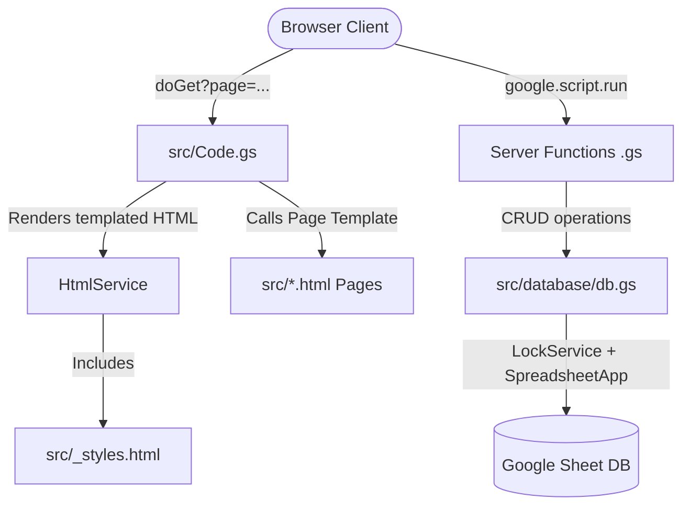

# AGENTS.md

## System Architecture

The application is structured as a Google Apps Script (GAS) web app with a Google Sheet functioning as a relational database. It serves server-rendered HTML pages containing client-side logic. There is no build/transpilation step; source files inside `src/` are pushed directly to Google Apps Script using `clasp`.



### Core Components
- **Entry point**: [Code.gs](file:///C:/Users/saich/Documents/popoWebApp/src/Code.gs) handles routing via `doGet(e)` based on the `?page=` query parameter.
- **Database Engine**: [db.gs](file:///C:/Users/saich/Documents/popoWebApp/src/database/db.gs) handles all CRUD operations on Google Sheets. It wraps all mutations in `LockService.getDocumentLock()` (with a 30s timeout) to prevent write conflicts.
- **Session & Auth**: [auth.gs](file:///C:/Users/saich/Documents/popoWebApp/src/auth/auth.gs) manages session lifecycle. Sessions are cached in `CacheService.getScriptCache()` (12h expiration TTL), and session tokens are stored in the client's `localStorage` as `popo_token`.
- **Global Design & Utility System**: [_styles.html](file:///C:/Users/saich/Documents/popoWebApp/src/_styles.html) is embedded in every template via `<?!= include('_styles') ?>`. It contains all CSS styles, Tailwind configuration alternatives, toast alerts, loading states, navigation handlers, and dynamic user avatar rendering.

---

## Workspace File Structure

### Client & Server Code (`src/`)

The application is divided into server-side controllers (`.gs`) and client-side page views (`.html`).

#### Root Files
- [Code.gs](file:///C:/Users/saich/Documents/popoWebApp/src/Code.gs): Page routers, authentication filters, and server evaluation utilities.
- [_styles.html](file:///C:/Users/saich/Documents/popoWebApp/src/_styles.html): Global layouts, design system variables, and DOM scripts.

#### Module Directories
- `src/auth/`: [auth.gs](file:///C:/Users/saich/Documents/popoWebApp/src/auth/auth.gs), login, password change, and profile edit views.
- `src/database/`: [db.gs](file:///C:/Users/saich/Documents/popoWebApp/src/database/db.gs), setup scripts, and the setup wizard.
- `src/admin/`: Admin APIs and views for school info, classes, subjects, indicators, weights, enrollments, workload, audit, and DB status.
- `src/teacher/`: Classroom/grading APIs and views for students, attendance, formative, summative, characteristics, read-think-write, activities, and reports.
- `src/shared/`: Dashboard, help, reference views, error pages, and [testapi.gs](file:///C:/Users/saich/Documents/popoWebApp/src/shared/testapi.gs).

`Code.gs` keeps URL routes stable by mapping logical page names such as `admin_subjects` to Apps Script template identifiers such as `admin/admin_subjects` through `TEMPLATE_PATHS`.

---

## Sheet Tabs (Database Tables)

The single master Google Sheet (ID specified in the script's `DB_SHEET_ID` property) contains the following tables:
- **`Users`**: `user_id`, `username`, `password_hash`, `salt`, `full_name`, `role`, `avatar`, `created_at`
- **`SchoolInfo`**: `school_name`, `district`, `province`, `academic_year`, `semester_start_date`, `required_attendance_days`, `semester`, `school_address`, `phone_number`, `education_area`, `school_logo`, `measurement_head_name`, `academic_head_name`, `director_name`
- **`Classes`**: `class_id`, `level`, `section`, `homeroom_teacher_user_id`, `homeroom_teacher_user_ids` (CSV import uses `homeroom_teacher_fullname`, supports multiple comma-separated teacher names, resolved to `user_id` server-side)
- **`Subjects`**: `subject_id`, `class_id`, `subject_name`, `subject_code`, `hours_per_year`, `weight_group`, `subject_group`
- **`Enrollments`**: `enrollment_id`, `class_id`, `subject_id`, `teacher_user_id`, `dev_activity_result`
- **`Students`**: `student_id`, `class_id`, `seq_no`, `student_code`, `citizen_id`, `full_name`, `dob`, `note`
- **`Indicators`**: `indicator_id`, `subject_id`, `code`, `description`, `max_score`, `display_order`
- **`SubjectWeights`**: `subject_id`, `coursework_max`, `final_max`, `pre_mid_max`, `mid_max`, `post_mid_max`, `final_exam_max`
- **`Attendance`**: `attendance_id`, `student_id`, `subject_id`, `date`, `period`, `status`, `updated_by`, `updated_at`
- **`IndicatorScores`**: `id`, `student_id`, `subject_id`, `indicator_id`, `score`, `updated_by`, `updated_at`
- **`SummativeScores`**: `id`, `student_id`, `subject_id`, `coursework`, `midterm`, `final`, `total`, `computed_grade`, `makeup_grade`, `final_grade`, `updated_by`, `updated_at`
- **`Characteristics`**: `id`, `student_id`, `subject_id`, `t1`...`t8`, `total`, `label`, `updated_by`, `updated_at`
- **`ReadThinkWrite`**: `id`, `student_id`, `subject_id`, `r1`...`r3`, `t1`...`t4`, `w1`...`w3`, `total`, `label`, `updated_by`, `updated_at`
- **`AuditLog`**: `timestamp`, `user_id`, `entity`, `entity_id`, `old_value`, `new_value`
- **`DevActivity`**: `id`, `student_id`, `class_id`, `subject_id`, `result`, `updated_by`, `updated_at`
- **`Holidays`**: `holiday_id`, `start_date`, `end_date`, `name`, `type`, `description`, `created_by`, `updated_at`

Date fields in the database should be stored in global ISO date format (`yyyy-mm-dd`). Frontend pages should display those dates in Thai format for users, such as `2 มิถุนายน 2567`, while preserving ISO values in hidden inputs or payloads sent back to Apps Script.

---

## Deployment & Clasp Configuration

Deployment settings are configured in `.clasp.json`:
- `rootDir` is configured to `src/` to push files inside it directly to the root of the Google Apps Script project.
- Redeployments should always target the **Production Deployment ID** to keep the application URL constant.
- The Apps Script project has previously reached the 200-version project history limit. If `clasp redeploy` fails with `Cannot create more versions`, first delete unused versions from Apps Script **Project History**. Versions used by active deployments cannot be deleted until those deployments are archived or repointed. After cleanup, run the normal production redeploy command below.

```sh
# Push code files to Google Apps Script
npx clasp push

# Redeploy production using the stable ID
npx clasp redeploy AKfycbxoOgEwrVOCxFvZEQahEiCvfB29gu5rQ8z1kplcMjipkzSBrZe6GrbkGHF4VwO8M4mA --description "Release Description"
```

**Production URL**: `https://script.google.com/macros/s/AKfycbxoOgEwrVOCxFvZEQahEiCvfB29gu5rQ8z1kplcMjipkzSBrZe6GrbkGHF4VwO8M4mA/exec`

Use this same URL as `WEB_APP_URL` when running production smoke tests.

**Current deployment state**:
- Stable production deployment ID: `AKfycbxoOgEwrVOCxFvZEQahEiCvfB29gu5rQ8z1kplcMjipkzSBrZe6GrbkGHF4VwO8M4mA`
- Stable production version: `269`
- HEAD deployment ID: `AKfycbzqTBsB-Qb4gl7dcbE7KwdM_hqAxUuml9Hk6rfAAIo`
- The HEAD deployment URL redirects to Google sign-in in automation and should not replace the public production URL unless its access settings are intentionally changed in Apps Script.
- Latest verified production release: `Implement UX UI report improvements`

---

## Testing & Automation Architecture

The test suite is built on **Playwright** with custom configurations for Google Apps Script's iframe sandboxing and unverified script notices.

### Configuration (`playwright.config.ts`)
- **Workers**: Must be set to `1` to avoid concurrency lock exceptions in Google Sheets.
- **Timeout**: Set to `60,000ms` to accommodate Spreadsheet API latency.
- **Projects**:
  - `setup`: Triggers [auth.setup.ts](file:///C:/Users/saich/Documents/popoWebApp/tests/auth.setup.ts) once to cache credentials.
  - `chromium`: Main test project referencing `tests/.auth/auth.json` as its `storageState`.

### Test Data Isolation & Endpoints
To avoid polluting production data, all test cases must interact with the dedicated test API in [testapi.gs](file:///C:/Users/saich/Documents/popoWebApp/src/shared/testapi.gs) through [seed.ts](file:///C:/Users/saich/Documents/popoWebApp/tests/helpers/seed.ts):
- Any mocked classroom, teacher, or student record must have its primary ID prefixed with `test_` (e.g. `test_teacher_math`).
- The test API strictly validates the `test_` prefix before modifying database sheets.
- `cleanupTestData()` is triggered at the end of each spec to delete all `test_` records across all sheets.

### Sandbox Iframe Traversal
Google Apps Script renders web apps inside nested iframe windows. To interact with elements, tests must traverse:
`Parent Window` -> `#sandboxFrame` (middle iframe) -> `#userHtmlFrame` (inner iframe).

Playwright tests use a custom wrapper [custom-test.ts](file:///C:/Users/saich/Documents/popoWebApp/tests/helpers/custom-test.ts) to automatically proxy locator calls through these frames:

```typescript
// Traversing nested sandboxed frames in tests/helpers/custom-test.ts
const frameLocator = page.frameLocator('#sandboxFrame').frameLocator('#userHtmlFrame');
```

---

## Critical Google Apps Script Quirks & Conventions

- **Caja Sandbox JS Restriction**: The Caja sanitizer strips base64 encoding from inline `<script>` tags, causing image loads to fail. Avatars and system images must be set dynamically through client-side scripting or loaded via external HTTP URLs (e.g. Raw GitHub URLs) rather than compiled into script assets.
- **Type Conversions**: Values retrieved from spreadsheet rows containing numeric indices (like section ids or levels) will be returned as raw numeric types (e.g., `1` instead of `"1"`). Ensure type parity by parsing comparisons using `String()` (e.g., `String(row.section) === '1'`).
- **Dynamic Navbar Injection**: Dynamic changes to the navbar (such as injecting user avatars and substituting the base name with `'ระบบจัดการ ป.พ.5 ออนไลน์'`) are handled client-side in `initNavbarAvatar()` inside [_styles.html](file:///C:/Users/saich/Documents/popoWebApp/src/_styles.html) once the profile retrieves successfully.
- **Name Parsing**: When users enter prefixes, first names, and surnames, the entries are normalized and combined into a single `full_name` string containing no space between prefix and first name, and one space before the surname (e.g., `"นายโนโน่ สดใส"`).
