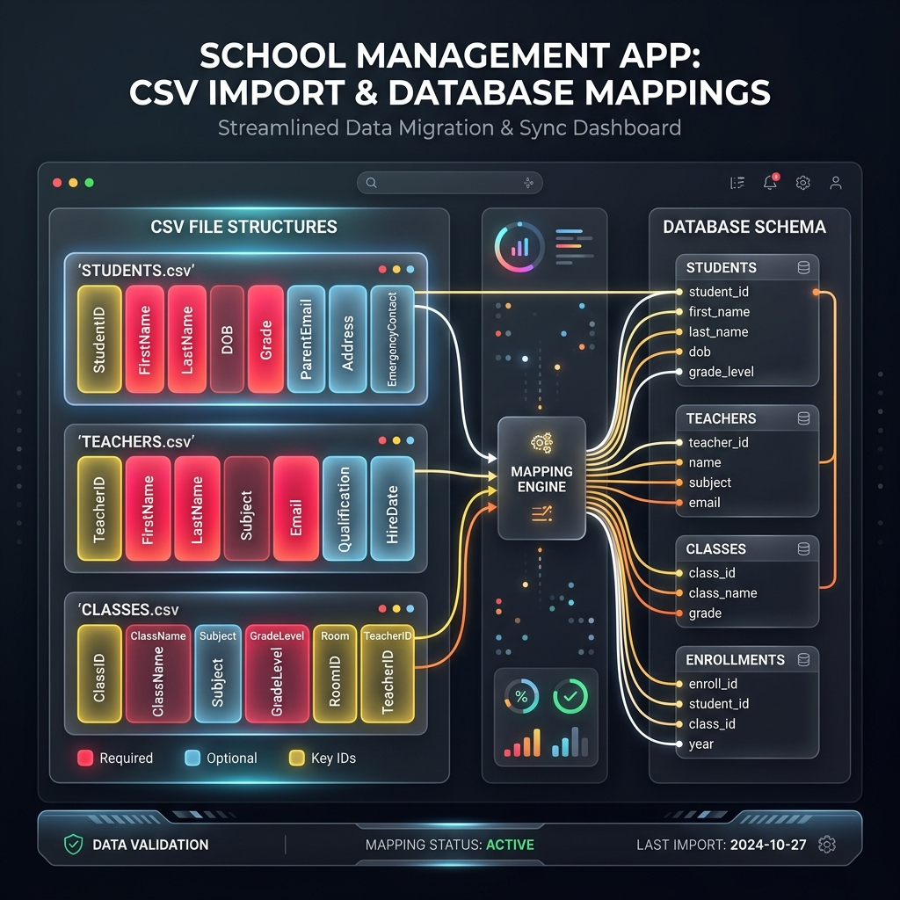
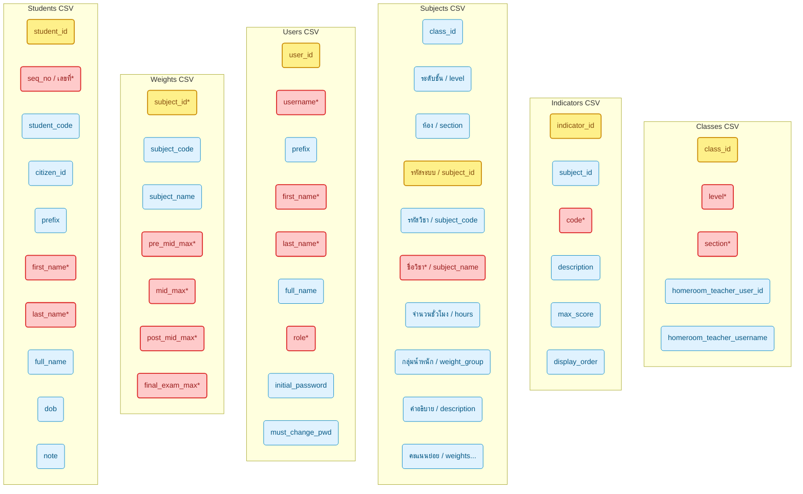

# CSV Column Structures & Data Schema Analysis

This document provides a detailed breakdown of the CSV import/export column schemas, data validation requirements, and relationships for the various administrative and classroom modules in the application.

---

## 1. Class Management ([admin_classes.html](file:///home/chang/Documents/popoWebApp/src/admin_classes.html))
Used to provision class structures (e.g., Grade Level and Section) and assign Homeroom Teachers.

* **Filename Template:** `classes_import_template.csv`
* **Target Table:** `Classes`

| CSV Header | Target Attribute | Required | Example | Description / Validation |
| :--- | :--- | :---: | :--- | :--- |
| **`class_id`** | `class_id` | No | `class_01` | System ID. If provided, updates existing class; if blank, creates new class. |
| **`level*`** | `level` | **Yes** | `ป.1` | Grade Level in Thai format (e.g., ป.1, ม.3). |
| **`section*`** | `section` | **Yes** | `1` | Section/Room number (usually a number as string). |
| **`homeroom_teacher_user_id`** | `homeroom_teacher_user_id` | No | `usr_9823` | ID of the teacher assigned to this classroom. |
| **`homeroom_teacher_username`** | `homeroom_teacher_username` | No | `somchai.t` | Alternative to assign by username instead of system ID. |

> [!NOTE]
> Either `level` and `section` must be present. If both are blank, the row is ignored.

---

## 2. Curriculum Indicators ([admin_indicators.html](file:///home/chang/Documents/popoWebApp/src/admin_indicators.html))
Used to configure specific curriculum grading standards/objectives for each subject.

* **Filename Template:** `indicators_import_template_<SUBJECT_ID>.csv`
* **Target Table:** `Indicators`

| CSV Header | Target Attribute | Required | Example | Description / Validation |
| :--- | :--- | :---: | :--- | :--- |
| **`indicator_id`** | `indicator_id` | No | `ind_05` | System ID to update an existing indicator. |
| **`subject_id`** | `subject_id` | **Yes** | `sub_101` | Must match the active context `SUBJECT_ID` inside the view. |
| **`code*`** | `code` | **Yes** | `ต 1.1 ป.1/1` | Standard/Indicator official curriculum code. |
| **`description`** | `description` | No | `ปฏิบัติตามคำสั่งง่ายๆ` | Plain text description of the target criteria. |
| **`max_score`** | `max_score` | **Yes** | `3` | Max grading score (e.g., 3, 5, 10). |
| **`display_order`** | `display_order` | **Yes** | `1` | Integer sequence value sorting indicators in grids. |

> [!WARNING]
> If a row has a `subject_id` that does not match the active context subject, that row is silently skipped to prevent importing indicators to the wrong course.

---

## 3. Subjects & Course Planning ([admin_subjects.html](file:///home/chang/Documents/popoWebApp/src/admin_subjects.html))
Defines academic courses and maps them to classrooms. It can also initialize score weight distributions.

* **Filename Template:** `subjects_import_template.csv`
* **Target Table:** `Subjects`, `Enrollments`, and `SubjectWeights`

| CSV Header | Target Attribute | Required | Example | Description / Validation |
| :--- | :--- | :---: | :--- | :--- |
| **`class_id`** | `class_id` | No | `class_01` | Target classroom ID. |
| **`ระดับชั้น`** | `class_level` | No | `ป.1` | Used only if `class_id` is empty (along with `ห้อง`). |
| **`ห้อง`** | `class_section` | No | `1` | Used only if `class_id` is empty (along with `ระดับชั้น`). |
| **`รหัสระบบ`** | `subject_id` | No | `sub_201` | System ID to update an existing subject. |
| **`รหัสวิชา`** | `subject_code` | No | `ท11101` | School-facing course code. |
| **`ชื่อวิชา*`** | `subject_name` | **Yes** | `ภาษาไทย` | Subject name. |
| **`จำนวนชั่วโมง`** | `hours` | No | `200` | Teaching load hours per year. |
| **`กลุ่มน้ำหนัก`** | `weight_group` | No | `1` | Weights categorization group (defaults to 1). |
| **`คำอธิบาย`** | `description` | No | `วิชาพื้นฐาน` | Course scope summary. |
| **`ก่อนกลางภาค`** | `pre_mid_max` | No | `30` | Coursework: pre-midterm max weight. |
| **`กลางภาค`** | `mid_max` | No | `20` | Coursework: midterm exam max weight. |
| **`หลังกลางภาค`** | `post_mid_max` | No | `20` | Coursework: post-midterm max weight. |
| **`ปลายภาค`** | `final_exam_max` | No | `30` | Final exam max weight. |

> [!IMPORTANT]
> - `ชื่อวิชา*` (Subject Name) is strictly required.
> - A target classroom must be identifiable. Therefore, you must supply either `class_id` **OR** both `ระดับชั้น` and `ห้อง`.
> - If point splits are provided, the sum of `ก่อนกลางภาค + กลางภาค + หลังกลางภาค + ปลายภาค` must equal **100** to apply weights configurations successfully.

---

## 4. User Registry ([admin_users.html](file:///home/chang/Documents/popoWebApp/src/admin_users.html))
Supports bulk setup of administrative and teaching staff accounts.

* **Filename Template:** `users_import_template.csv`
* **Target Table:** `Users`

| CSV Header | Target Attribute | Required | Example | Description / Validation |
| :--- | :--- | :---: | :--- | :--- |
| **`user_id`** | `user_id` | No | `usr_301` | System user ID to update existing account info. |
| **`username*`** | `username` | **Yes** | `teacher.s` | Unique system credentials username. |
| **`prefix`** | `prefix` | No | `นาย` | Academic or social title (e.g., นาย, นาง, นางสาว, ดร.). |
| **`first_name*`** | `first_name` | **Yes** | `สมชาย` | Required if `full_name` is blank. |
| **`last_name*`** | `last_name` | **Yes** | `ใจดี` | Required if `full_name` is blank. |
| **`full_name`** | `full_name` | No | `นายสมชาย ใจดี` | If blank, computed as: `[prefix][first_name] [last_name]`. |
| **`role*`** | `role` | **Yes** | `teacher` | System access role. Must be either `teacher` or `admin`. |
| **`initial_password`** | `initial_password` | No | `Reset9988` | Initial login password. |
| **`must_change_pwd`** | `must_change_pwd` | No | `true` | If set to `true`, forces change of password at next login. |

---

## 5. Subject Score Weights ([admin_weights.html](file:///home/chang/Documents/popoWebApp/src/admin_weights.html))
Dedicated weight scoring setup for subjects.

* **Filename Template:** `subject_weights_template.csv`
* **Target Table:** `SubjectWeights`

| CSV Header | Target Attribute | Required | Example | Description / Validation |
| :--- | :--- | :---: | :--- | :--- |
| **`subject_id*`** | `subject_id` | **Yes** | `sub_201` | System ID of the target subject (must exist). |
| **`subject_code`** | — | No | `ท11101` | Read-only reference column. |
| **`subject_name`** | — | No | `ภาษาไทย` | Read-only reference column. |
| **`pre_mid_max*`** | `pre_mid_max` | **Yes** | `30` | Pre-midterm assessment weight. |
| **`mid_max*`** | `mid_max` | **Yes** | `20` | Midterm exam weight. |
| **`post_mid_max*`** | `post_mid_max` | **Yes** | `20` | Post-midterm assessment weight. |
| **`coursework_max`** | `coursework_max` | No | `70` | Coursework total (Calculated dynamically: Pre + Mid + Post). |
| **`final_exam_max*`** | `final_exam_max` | **Yes** | `30` | Semester final exam weight. |
| **`final_max`** | `final_max` | No | `30` | Final total weight (Calculated: 100 - Coursework). |
| **`total`** | — | No | `100` | Verification column (Must sum up to exactly 100). |

> [!CAUTION]
> The parser strictly enforces that `pre_mid_max + mid_max + post_mid_max + final_exam_max` **MUST equal 100**. If a row sums to any other value, it is discarded and reported as an error.

---

## 6. Student Roster ([class_students.html](file:///home/chang/Documents/popoWebApp/src/class_students.html))
Allows homeroom teachers to import student lists into their designated class.

* **Filename Template:** `students_import_template_<CLASS_ID>.csv`
* **Target Table:** `Students`

| CSV Header Options | Target Attribute | Required | Example | Description / Validation |
| :--- | :--- | :---: | :--- | :--- |
| **`student_id`** | `student_id` | No | `std_105` | System student record ID to update details. |
| **`seq_no`** or **`เลขที่*`** | `seq_no` | **Yes** | `1` | Class roll number order. |
| **`student_code`** or **`เลขประจำตัว`** | `student_code` | No | `65001` | Official school student ID code. |
| **`citizen_id`** or **`เลขประจำตัวประชาชน`** | `citizen_id` | No | `1100200030044` | National identity number (13 digits). |
| **`prefix`** | `prefix` | No | `เด็กชาย` | Title (e.g., เด็กชาย, เด็กหญิง, นาย, นางสาว). |
| **`first_name*`** | `first_name` | **Yes** | `สมพงษ์` | Student first name (Required if `full_name` is blank). |
| **`last_name*`** | `last_name` | **Yes** | `เรียนเก่ง` | Student last name (Required if `full_name` is blank). |
| **`full_name`** or **`ชื่อ-สกุล`** | `full_name` | No | `เด็กชายสมพงษ์ เรียนเก่ง` | If empty, resolved as: `[prefix][first_name] [last_name]`. |
| **`dob`** or **`วันเกิด`** | `dob` | No | `01 ม.ค. 60` | Birthday string. |
| **`note`** or **`หมายเหตุ`** | `note` | No | `ย้ายมาจากโรงเรียนอื่น` | Any notes or exceptions. |

> [!TIP]
> The student import header is **flexible**. The client-side parser checks for English header keys first and falls back to traditional Thai labels (e.g., it matches both `seq_no` and `เลขที่` for the roll sequence).
