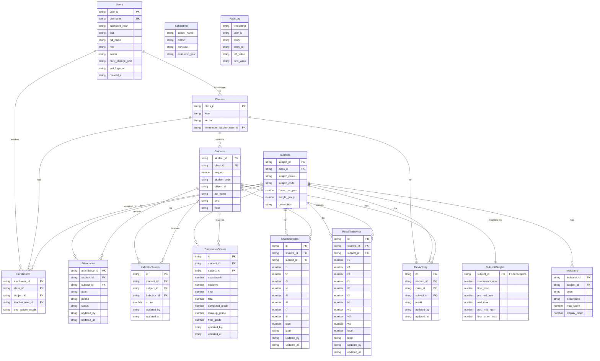

# 2.2 Database Design

> Design reference: verify the current schema against [`AGENTS.md`](../../AGENTS.md) and `src/database/setup.gs`.

## 1. Overview

The popoWebApp uses a **Google Sheets spreadsheet** as a relational database, referenced by the `DB_SHEET_ID` Script Property. The spreadsheet contains **15 tabs** (worksheet sheets), each representing a database table with a header row defining column names and data rows below it.

All data access is mediated through `db.gs`, a thin wrapper around `SpreadsheetApp` that provides `dbGetAll`, `dbInsert`, `dbUpdate`, `dbDelete`, `dbFind`, and `dbFindOne` operations. Every write operation acquires `LockService.getDocumentLock()` (30-second timeout) to prevent concurrent write conflicts.

The schema is bootstrapped by `setupDatabase()` in `setup.gs`, which creates the spreadsheet, ensures all 15 tabs exist with correct headers, and seeds the default admin user.

---

## 2. ER Diagram



---

## 3. Full Table Schemas

### 3.1 Users

| Column | Data Type | Constraints | Description |
|---|---|---|---|
| `user_id` | String (UUID) | PK, Auto-generated | Unique user identifier (`user_` prefix) |
| `username` | String | Unique, Not Null | Login name (Thai: ชื่อผู้ใช้) |
| `password_hash` | String | Not Null | SHA-256 hash of password+salt |
| `salt` | String (UUID) | Not Null | Per-user UUID salt for hashing |
| `full_name` | String | Not Null | Display name, e.g. `"นายโนโน่ สดใส"` |
| `role` | String | Not Null, `'admin'` or `'teacher'` | บทบาทผู้ใช้ |
| `avatar` | String | Default: `''` | Google Drive avatar URL |
| `must_change_pwd` | String | Default: `'true'` for teachers | Force password change on next login |
| `last_login_at` | ISO Date | Default: `''` | Last successful login timestamp |
| `created_at` | ISO Date | Auto-generated | Account creation timestamp |

### 3.2 SchoolInfo

| Column | Data Type | Constraints | Description |
|---|---|---|---|
| `school_name` | String | Not Null | ชื่อโรงเรียน |
| `district` | String | | อำเภอ |
| `province` | String | | จังหวัด |
| `academic_year` | String | | ปีการศึกษา (e.g. `"2567"` or `"2024"`) |

> **Note:** SchoolInfo is a singleton table — only one data row (row 2) is used. Updates overwrite that single row.

### 3.3 Classes

| Column | Data Type | Constraints | Description |
|---|---|---|---|
| `class_id` | String | PK | Format: `class_{level}_{section}`, e.g. `class_ม1_1`, `class_ป4_2` |
| `level` | String | Not Null | ระดับชั้น, e.g. `"ม1"`, `"ป4"` |
| `section` | String | Not Null | ห้อง, e.g. `"1"`, `"2"` |
| `homeroom_teacher_user_id` | String | FK → Users.user_id | ครูประจำชั้น (optional) |

### 3.4 Subjects

| Column | Data Type | Constraints | Description |
|---|---|---|---|
| `subject_id` | String | PK | Auto-generated from `generateClassSubjectId()` or preset |
| `class_id` | String | FK → Classes.class_id | Which class this subject belongs to |
| `subject_name` | String | Not Null | ชื่อวิชา, e.g. `"ภาษาไทย ม.1"` |
| `subject_code` | String | | Thai education code, e.g. `"ท21101"`, `"ค21101"` |
| `hours_per_year` | Number | Default: `0` | จำนวนชั่วโมงต่อปี |
| `weight_group` | Number | `1` or `2` | Weight group (กลุ่มคะแนน), determines default SubjectWeights |
| `description` | String | Default: `''` | รายละเอียดวิชา |

### 3.5 Enrollments

| Column | Data Type | Constraints | Description |
|---|---|---|---|
| `enrollment_id` | String (UUID) | PK, Auto-generated | Unique enrollment ID (`enr_` prefix) |
| `class_id` | String | FK → Classes.class_id | ชั้นเรียน |
| `subject_id` | String | FK → Subjects.subject_id | วิชา |
| `teacher_user_id` | String | FK → Users.user_id | ครูผู้สอน |
| `dev_activity_result` | String | Default: `''` | ผลการพัฒนากิจกรรม |

> **Uniqueness constraint:** `(class_id, subject_id)` must be unique — only one teacher per class+subject pair. Enforced in application code.

### 3.6 Students

| Column | Data Type | Constraints | Description |
|---|---|---|---|
| `student_id` | String (UUID) | PK, Auto-generated | Unique student ID (`student_` prefix) |
| `class_id` | String | FK → Classes.class_id, Not Null | ชั้นเรียนที่สังกัด |
| `seq_no` | Number | Default: `0` | เลขที่ในห้อง (ordering) |
| `student_code` | String | Default: `''` | รหัสนักเรียน |
| `citizen_id` | String | Unique within class | เลขประจำตัวประชาชน |
| `full_name` | String | Not Null | ชื่อ-สกุล |
| `dob` | String | Default: `''` | วันเกิด (ISO date or Thai format) |
| `note` | String | Default: `''` | หมายเหตุ |

> **Uniqueness constraint:** `citizen_id` must be unique within the same `class_id`.

### 3.7 Indicators

| Column | Data Type | Constraints | Description |
|---|---|---|---|
| `indicator_id` | String (UUID) | PK, Auto-generated | ตัวชี้วัด ID (`ind_` prefix) |
| `subject_id` | String | FK → Subjects.subject_id, Not Null | วิชาที่เป็นของตัวชี้วัด |
| `code` | String | | รหัสตัวชี้วัด |
| `description` | String | | คำอธิบายตัวชี้วัด |
| `max_score` | Number | | คะแนนเต็มของตัวชี้วัด |
| `display_order` | Number | Default: `0` | ลำดับการแสดงผล |

### 3.8 SubjectWeights

| Column | Data Type | Constraints | Description |
|---|---|---|---|
| `subject_id` | String | PK, FK → Subjects.subject_id | วิชาที่กำหนดค่าน้ำหนัก |
| `coursework_max` | Number | Not Null | คะแนนเก็บรวมสูงสุด (= pre_mid_max + mid_max + post_mid_max) |
| `final_max` | Number | Not Null | คะแนนสอบรวมสูงสุด (= final_exam_max) |
| `pre_mid_max` | Number | Not Null | คะแนนก่อกลางภาคสูงสุด |
| `mid_max` | Number | Not Null | คะแนนสอบกลางภาคสูงสุด |
| `post_mid_max` | Number | Not Null | คะแนนหลังกลางภาคสูงสุด |
| `final_exam_max` | Number | Not Null | คะแนนสอบปลายภาคสูงสุด |

> **Validation:** `pre_mid_max + mid_max + post_mid_max + final_exam_max = 100`

> **Derived:** `coursework_max = pre_mid_max + mid_max + post_mid_max`; `final_max = final_exam_max`

### 3.9 Attendance

| Column | Data Type | Constraints | Description |
|---|---|---|---|
| `attendance_id` | String (UUID) | PK, Auto-generated | รหัสการเช็คชื่อ (`att_` prefix) |
| `student_id` | String | FK → Students.student_id | นักเรียน |
| `subject_id` | String | FK → Subjects.subject_id | วิชา |
| `date` | String (ISO Date) | Not Null | วันที่เช็คชื่อ (YYYY-MM-DD) |
| `period` | String | | คาบเรียน |
| `status` | String | `"/"`, `"ล"`, `"ข"`, or `""` | เช็คชื่อ: `/`=มา, `ล`=ลา, `ข`=ขาด |
| `updated_by` | String | FK → Users.user_id | ผู้บันทึกล่าสุด |
| `updated_at` | ISO Date | Auto-generated | เวลาบันทึกล่าสุด |

> **Upsert key:** `(student_id, subject_id, date)` — same student+subject+date updates in place.

### 3.10 IndicatorScores

| Column | Data Type | Constraints | Description |
|---|---|---|---|
| `id` | String (UUID) | PK, Auto-generated | รหัสแถว (`iscore_` prefix) |
| `student_id` | String | FK → Students.student_id | นักเรียน |
| `subject_id` | String | FK → Subjects.subject_id | วิชา |
| `indicator_id` | String | FK → Indicators.indicator_id | ตัวชี้วัด |
| `score` | Number | ≥ 0 | คะแนนที่ได้ |
| `updated_by` | String | FK → Users.user_id | ผู้บันทึกล่าสุด |
| `updated_at` | ISO Date | Auto-generated | เวลาบันทึกล่าสุด |

> **Upsert key:** `(student_id, subject_id, indicator_id)`

### 3.11 SummativeScores

| Column | Data Type | Constraints | Description |
|---|---|---|---|
| `id` | String (UUID) | PK, Auto-generated | รหัสแถว (`ssum_` prefix) |
| `student_id` | String | FK → Students.student_id | นักเรียน |
| `subject_id` | String | FK → Subjects.subject_id | วิชา |
| `coursework` | Number | | คะแนนเก็บ (pre_mid + mid + post_mid) |
| `midterm` | Number | | คะแนนสอบกลางภาค |
| `final` | Number | | คะแนนสอบปลายภาค |
| `total` | Number | Computed | คะแนนรวม (coursework + midterm + final) |
| `computed_grade` | Number | Computed | เกรดจาก total ตามมาตรวัด |
| `makeup_grade` | Number | | เกรดทดแทน (manual override) |
| `final_grade` | Number | Computed | เกรดสุดท้าย (= makeup_grade ถ้ามี, มิฉะนั้น computed_grade) |
| `updated_by` | String | FK → Users.user_id | ผู้บันทึกล่าสุด |
| `updated_at` | ISO Date | Auto-generated | เวลาบันทึกล่าสุด |

> **Upsert key:** `(student_id, subject_id)`

### 3.12 Characteristics

| Column | Data Type | Constraints | Description |
|---|---|---|---|
| `id` | String (UUID) | PK, Auto-generated | รหัสแถว (`char_` prefix) |
| `student_id` | String | FK → Students.student_id | นักเรียน |
| `subject_id` | String | FK → Subjects.subject_id | วิชา |
| `t1` | Number | 0–10 | คุณลักษณะที่ 1 |
| `t2` | Number | 0–10 | คุณลักษณะที่ 2 |
| `t3` | Number | 0–10 | คุณลักษณะที่ 3 |
| `t4` | Number | 0–10 | คุณลักษณะที่ 4 |
| `t5` | Number | 0–10 | คุณลักษณะที่ 5 |
| `t6` | Number | 0–10 | คุณลักษณะที่ 6 |
| `t7` | Number | 0–10 | คุณลักษณะที่ 7 |
| `t8` | Number | 0–10 | คุณลักษณะที่ 8 |
| `total` | Number | Computed (sum of t1..t8) | คะแนนรวม (max 80) |
| `label` | String | Computed | ระดับ: ดีเยี่ยม/ดี/ผ่านเกณฑ์/ไม่ผ่าน |
| `updated_by` | String | FK → Users.user_id | ผู้บันทึกล่าสุด |
| `updated_at` | ISO Date | Auto-generated | เวลาบันทึกล่าสุด |

> **Upsert key:** `(student_id, subject_id)`

### 3.13 ReadThinkWrite

| Column | Data Type | Constraints | Description |
|---|---|---|---|
| `id` | String (UUID) | PK, Auto-generated | รหัสแถว (`rtw_` prefix) |
| `student_id` | String | FK → Students.student_id | นักเรียน |
| `subject_id` | String | FK → Subjects.subject_id | วิชา |
| `r1` | Number | 0–10 | อ่าน ข้อ 1 |
| `r2` | Number | 0–10 | อ่าน ข้อ 2 |
| `r3` | Number | 0–10 | อ่าน ข้อ 3 |
| `t1` | Number | 0–10 | คิด ข้อ 1 |
| `t2` | Number | 0–10 | คิด ข้อ 2 |
| `t3` | Number | 0–10 | คิด ข้อ 3 |
| `t4` | Number | 0–10 | คิด ข้อ 4 |
| `w1` | Number | 0–10 | เขียน ข้อ 1 |
| `w2` | Number | 0–10 | เขียน ข้อ 2 |
| `w3` | Number | 0–10 | เขียน ข้อ 3 |
| `total` | Number | Computed (sum of r1..r3+t1..t4+w1..w3) | คะแนนรวม (max 100) |
| `label` | String | Computed | ระดับ: ดีเยี่ยม/ดี/ผ่านเกณฑ์/ไม่ผ่าน |
| `updated_by` | String | FK → Users.user_id | ผู้บันทึกล่าสุด |
| `updated_at` | ISO Date | Auto-generated | เวลาบันทึกล่าสุด |

> **Upsert key:** `(student_id, subject_id)`

### 3.14 AuditLog

| Column | Data Type | Constraints | Description |
|---|---|---|---|
| `timestamp` | ISO Date | Auto-generated | เวลาที่เกิดเหตุการณ์ |
| `user_id` | String | FK → Users.user_id | ผู้ใช้ที่ทำการเปลี่ยนแปลง |
| `entity` | String | Not Null | ชื่อตาราง เช่น `"Users"`, `"Students"` |
| `entity_id` | String | Not Null | PK ของแถวที่ถูกเปลี่ยน |
| `old_value` | String (JSON) | | ค่าเดิม (JSON serialized) |
| `new_value` | String (JSON) | | ค่าใหม่ (JSON serialized) |

> The AuditLog is append-only. No updates or deletes are performed.

### 3.15 DevActivity

| Column | Data Type | Constraints | Description |
|---|---|---|---|
| `id` | String (UUID) | PK, Auto-generated | รหัสแถว |
| `student_id` | String | FK → Students.student_id | นักเรียน |
| `class_id` | String | FK → Classes.class_id | ชั้นเรียน |
| `subject_id` | String | FK → Subjects.subject_id | วิชา |
| `result` | String | | ผลการพัฒนากิจกรรม |
| `updated_by` | String | FK → Users.user_id | ผู้บันทึกล่าสุด |
| `updated_at` | ISO Date | Auto-generated | เวลาบันทึกล่าสุด |

---

## 4. ID Generation Pattern

### 4.1 Generic UUID Generator

```javascript
function generateId(prefix) {
  return prefix + '_' + Utilities.getUuid().replace(/-/g, '').substring(0, 12);
}
```

This produces IDs of the format `{prefix}_{12_random_hex_chars}`, e.g. `user_a3f1b2c4d5e6`.

### 4.2 Prefix Registry

| Prefix | Table | Example |
|---|---|---|
| `user_` | Users | `user_8a7b3c9d1e2f` |
| `class_` | Classes | See `generateClassId()` below |
| `subj_` | Subjects | See `generateClassSubjectId()` below |
| `enr_` | Enrollments | `enr_4f2a8b1c3d7e` |
| `student_` | Students | `student_9c6e2f4a1b3d` |
| `ind_` | Indicators | `ind_5d8a1c3f2e4b` |
| `att_` | Attendance | `att_7b2d9e1a4c6f` |
| `iscore_` | IndicatorScores | `iscore_3e7f1d2a5b9c` |
| `ssum_` | SummativeScores | `ssum_6a1f8d4c2e3b` |
| `char_` | Characteristics | `char_2c9d4f7a1b5e` |
| `rtw_` | ReadThinkWrite | `rtw_8e3b5a2d7c1f` |

> The default admin user uses the format `admin_{8_random_hex_chars}` (special case in `seedDefaultAdmin()`).

### 4.3 Special ID Generators

#### `generateClassId(level, section)`
```javascript
function generateClassId(level, section) {
  return 'class_' + String(level).replace(/[\.\s]/g, '') + '_' + String(section).replace(/[\.\s]/g, '');
}
```
Produces deterministic IDs based on level and section, e.g.:
- `generateClassId('ม1', '1')` → `class_ม1_1`
- `generateClassId('ป4', '2')` → `class_ป4_2`

#### `generateClassSubjectId(subject_code, subject_name, class_id)`
```javascript
function generateClassSubjectId(subject_code, subject_name, class_id) {
  var base = generateSubjectId(subject_code, subject_name);
  var suffix = normalizeClassIdSuffix(class_id);
  return suffix ? base + '_' + suffix : base;
}
```
Combines a Thai-transliterated subject base with a normalized class suffix, e.g.:
- `generateClassSubjectId('ท21101', 'ภาษาไทย ม.1', 'class_ม1_1')` → `subj_thai_m1_1`

#### `generateSubjectId(subject_code, subject_name)`
Produces a `subj_` prefixed ID by transliterating Thai characters to ASCII, e.g.:
- `generateSubjectId('ท21101', 'ภาษาไทย ม.1')` → `subj_thai`

---

## 5. Key Data Constraints

### 5.1 Enrollments — Unique Class+Subject Pair

Each `(class_id, subject_id)` pair in the Enrollments table must be **unique**. This enforces the business rule that **only one teacher can be assigned per class+subject combination**. Enforced in application code (`enrollments.gs`):

```javascript
for (var i = 0; i < enrollments.length; i++) {
  if (enrollments[i].class_id === classId && enrollments[i].subject_id === subjectId) {
    existing = enrollments[i]; break;
  }
}
```

If a conflict is detected, the UI offers a reassignment flow (`handleConfirmReassign`).

### 5.2 Users — Unique Username

`username` must be unique across all users. Enforced by `dbFindOne('Users', 'username', username)` before insertion.

### 5.3 Class ID Format

Class IDs follow the pattern `class_{level}_{section}` where `level` and `section` have dots/spaces stripped. Examples: `class_ม1_1`, `class_ป4_2`, `class_ม3_3`.

### 5.4 Subject Code Format

Subject codes follow Thai education coding standards (กรมวิสามาคย), e.g.:
- `ท21101` — ภาษาไทย มัธยมศึกษาปีที่ 1
- `ค21101` — คณิตศาสตร์ มัธยมศึกษาปีที่ 1
- `อ11101` — ภาษาอังกฤษ ประถมศึกษาปีที่ 1

### 5.5 Weight Validation — Sum to 100

SubjectWeights must satisfy: `pre_mid_max + mid_max + post_mid_max + final_exam_max = 100`. Validated server-side in `serverSaveWeights()`:

```javascript
var total = Number(r.pre_mid_max) + Number(r.mid_max) + Number(r.post_mid_max) + Number(r.final_exam_max);
if (total !== 100) errors.push(r.subject_id);
```

The derived values are automatically computed:
- `coursework_max = pre_mid_max + mid_max + post_mid_max`
- `final_max = final_exam_max`

### 5.6 Attendance — Composite Key (Upsert)

Attendance records use a composite key of `(student_id, subject_id, date)`. When saving, existing records for the same student+subject+date are updated in place; new records are inserted.

### 5.7 Score Tables — Composite Upsert Keys

| Table | Upsert Key |
|---|---|
| IndicatorScores | `(student_id, subject_id, indicator_id)` |
| SummativeScores | `(student_id, subject_id)` |
| Characteristics | `(student_id, subject_id)` |
| ReadThinkWrite | `(student_id, subject_id)` |

### 5.8 Citizen ID Uniqueness

`citizen_id` must be unique within the same `class_id` in the Students table. Students with the same `citizen_id` across different classes are allowed.

### 5.9 Characteristics Score Bounds

Each trait field (`t1`–`t8`) is clamped to the range **0–10**, so `total` maxes out at **80**.

### 5.10 ReadThinkWrite Score Bounds

Each sub-field (`r1`–`r3`, `t1`–`t4`, `w1`–`w3`) is clamped to **0–10**, so `total` maxes out at **100**.

---

## 6. Weight Groups & Defaults

Subjects are assigned a `weight_group` of **1** or **2**, which determines the default score distribution in the `SubjectWeights` table.

### Group 1 — หมู่สาระการเรียนรู้ที่ 1 (Core Subjects)

| Field | Value | Description |
|---|---|---|
| `coursework_max` | 70 | คะแนนเก็บรวม |
| `final_max` | 30 | คะแนนสอบรวม |
| `pre_mid_max` | 25 | คะแนนก่อกลางภาค |
| `mid_max` | 20 | คะแนนสอบกลางภาค |
| `post_mid_max` | 25 | คะแนนหลังกลางภาค |
| `final_exam_max` | 30 | คะแนนสอบปลายภาค |

**Verification:** 25 + 20 + 25 + 30 = **100** ✓ | coursework_max = 25 + 20 + 25 = 70 | final_max = 30

### Group 2 — หมู่สาระการเรียนรู้ที่ 2 (Activity/Additional Subjects)

| Field | Value | Description |
|---|---|---|
| `coursework_max` | 80 | คะแนนเก็บรวม |
| `final_max` | 20 | คะแนนสอบรวม |
| `pre_mid_max` | 30 | คะแนนก่อกลางภาค |
| `mid_max` | 20 | คะแนนสอบกลางภาค |
| `post_mid_max` | 30 | คะแนนหลังกลางภาค |
| `final_exam_max` | 20 | คะแนนสอบปลายภาค |

**Verification:** 30 + 20 + 30 + 20 = **100** ✓ | coursework_max = 30 + 20 + 30 = 80 | final_max = 20

---

## 7. Grade Computation Rules

### 7.1 Summative Scores (คะแนน 2) — `computeGrade(total)`

Applied to `SummativeScores.total`. Returns a numeric GPA value:

| Total Score | Grade | Thai Label |
|---|---|---|
| ≥ 80 | 4 | ดีมาก |
| ≥ 75 | 3.5 | ดี |
| ≥ 70 | 3 | ค่อนข้างดี |
| ≥ 65 | 2.5 | พอใช้ |
| ≥ 60 | 2 | พอได้ |
| ≥ 55 | 1.5 | น้อย |
| ≥ 50 | 1 | ต่ำ |
| < 50 | 0 | ไม่ผ่าน |

**Special logic:** If `makeup_grade` is provided and non-empty, `final_grade = makeup_grade`; otherwise `final_grade = computed_grade`.

### 7.2 Characteristics (คุณลักษณะ) — `computeCharacteristicsLabel(total)`

Applied to `Characteristics.total` (max 80). Returns a Thai label string:

| Total Score | Label |
|---|---|
| ≥ 70 | ดีเยี่ยม |
| ≥ 60 | ดี |
| ≥ 50 | ผ่านเกณฑ์ |
| < 50 | ไม่ผ่าน |

### 7.3 Read-Think-Write (อ่าน-คิด-เขียน) — `computeReadThinkWriteLabel(total)`

Applied to `ReadThinkWrite.total` (max 100). Returns a Thai label string:

| Total Score | Label |
|---|---|
| ≥ 90 | ดีเยี่ยม |
| ≥ 80 | ดี |
| ≥ 70 | ผ่านเกณฑ์ |
| < 70 | ไม่ผ่าน |

---

## 8. Pre-seeded Subject Presets

The `PRESETS` variable in `admin_school_api.gs` provides four pre-built subject catalogs for rapid initial setup. Each preset creates matching entries in both the `Subjects` and `SubjectWeights` tables.

### 8.1 Preset: `p1_3` — ประถมศึกษาปีที่ 1–3 (30 subjects)

| # | ID | Name | Code | Hours | Group |
|---|---|---|---|---|---|
| 1 | subj_thai_p1 | ภาษาไทย ป.1 | ท11101 | 200 | 1 |
| 2 | subj_thai_p2 | ภาษาไทย ป.2 | ท12101 | 200 | 1 |
| 3 | subj_thai_p3 | ภาษาไทย ป.3 | ท13101 | 200 | 1 |
| 4 | subj_math_p1 | คณิตศาสตร์ ป.1 | ค11101 | 200 | 1 |
| 5 | subj_math_p2 | คณิตศาสตร์ ป.2 | ค12101 | 200 | 1 |
| 6 | subj_math_p3 | คณิตศาสตร์ ป.3 | ค13101 | 200 | 1 |
| 7 | subj_eng_p1 | ภาษาอังกฤษ ป.1 | อ11101 | 120 | 1 |
| 8 | subj_eng_p2 | ภาษาอังกฤษ ป.2 | อ12101 | 120 | 1 |
| 9 | subj_eng_p3 | ภาษาอังกฤษ ป.3 | อ13101 | 120 | 1 |
| 10 | subj_sci_p1 | วิทยาศาสตร์และเทคโนโลยี ป.1 | ว11101 | 80 | 1 |
| 11 | subj_sci_p2 | วิทยาศาสตร์และเทคโนโลยี ป.2 | ว12101 | 80 | 1 |
| 12 | subj_sci_p3 | วิทยาศาสตร์และเทคโนโลยี ป.3 | ว13101 | 80 | 1 |
| 13 | subj_soc_p1 | สังคมศึกษาฯ ป.1 | ส11101 | 80 | 1 |
| 14 | subj_soc_p2 | สังคมศึกษาฯ ป.2 | ส12101 | 80 | 1 |
| 15 | subj_soc_p3 | สังคมศึกษาฯ ป.3 | ส13101 | 80 | 1 |
| 16 | subj_hist_p1 | ประวัติศาสตร์ ป.1 | ส11102 | 40 | 1 |
| 17 | subj_hist_p2 | ประวัติศาสตร์ ป.2 | ส12102 | 40 | 1 |
| 18 | subj_hist_p3 | ประวัติศาสตร์ ป.3 | ส13102 | 40 | 1 |
| 19 | subj_pe_p1 | สุขศึกษาและพลศึกษา ป.1 | พ11101 | 40 | 2 |
| 20 | subj_pe_p2 | สุขศึกษาและพลศึกษา ป.2 | พ12101 | 40 | 2 |
| 21 | subj_pe_p3 | สุขศึกษาและพลศึกษา ป.3 | พ13101 | 40 | 2 |
| 22 | subj_art_p1 | ศิลปะ ป.1 | ศ11101 | 40 | 2 |
| 23 | subj_art_p2 | ศิลปะ ป.2 | ศ12101 | 40 | 2 |
| 24 | subj_art_p3 | ศิลปะ ป.3 | ศ13101 | 40 | 2 |
| 25 | subj_career_p1 | การงานอาชีพ ป.1 | ง11101 | 40 | 2 |
| 26 | subj_career_p2 | การงานอาชีพ ป.2 | ง12101 | 40 | 2 |
| 27 | subj_career_p3 | การงานอาชีพ ป.3 | ง13101 | 40 | 2 |
| 28 | subj_defense_p1 | ป้องกันการทุจริต ป.1 | ส11201 | 40 | 2 |
| 29 | subj_defense_p2 | ป้องกันการทุจริต ป.2 | ส12201 | 40 | 2 |
| 30 | subj_defense_p3 | ป้องกันการทุจริต ป.3 | ส13201 | 40 | 2 |

### 8.2 Preset: `p4_6` — ประถมศึกษาปีที่ 4–6 (30 subjects)

| # | ID | Name | Code | Hours | Group |
|---|---|---|---|---|---|
| 1 | subj_thai_p4 | ภาษาไทย ป.4 | ท14101 | 160 | 1 |
| 2 | subj_thai_p5 | ภาษาไทย ป.5 | ท15101 | 160 | 1 |
| 3 | subj_thai_p6 | ภาษาไทย ป.6 | ท16101 | 160 | 1 |
| 4 | subj_math_p4 | คณิตศาสตร์ ป.4 | ค14101 | 160 | 1 |
| 5 | subj_math_p5 | คณิตศาสตร์ ป.5 | ค15101 | 160 | 1 |
| 6 | subj_math_p6 | คณิตศาสสตร์ ป.6 | ค16101 | 160 | 1 |
| 7 | subj_eng_p4 | ภาษาอังกฤษ ป.4 | อ14101 | 80 | 1 |
| 8 | subj_eng_p5 | ภาษาอังกฤษ ป.5 | อ15101 | 80 | 1 |
| 9 | subj_eng_p6 | ภาษาอังกฤษ ป.6 | อ16101 | 80 | 1 |
| 10 | subj_sci_p4 | วิทยาศาสตร์และเทคโนโลยี ป.4 | ว14101 | 80 | 1 |
| 11 | subj_sci_p5 | วิทยาศาสตร์และเทคโนโลยี ป.5 | ว15101 | 80 | 1 |
| 12 | subj_sci_p6 | วิทยาศาสตร์และเทคโนโลยี ป.6 | ว16101 | 80 | 1 |
| 13 | subj_soc_p4 | สังคมศึกษาฯ ป.4 | ส14101 | 80 | 1 |
| 14 | subj_soc_p5 | สังคมศึกษาฯ ป.5 | ส15101 | 80 | 1 |
| 15 | subj_soc_p6 | สังคมศึกษาฯ ป.6 | ส16101 | 80 | 1 |
| 16 | subj_hist_p4 | ประวัติศาสตร์ ป.4 | ส14102 | 40 | 1 |
| 17 | subj_hist_p5 | ประวัติศาสตร์ ป.5 | ส15102 | 40 | 1 |
| 18 | subj_hist_p6 | ประวัติศาสตร์ ป.6 | ส16102 | 40 | 1 |
| 19 | subj_pe_p4 | สุขศึกษาและพลศึกษา ป.4 | พ14101 | 80 | 2 |
| 20 | subj_pe_p5 | สุขศึกษาและพลศึกษา ป.5 | พ15101 | 80 | 2 |
| 21 | subj_pe_p6 | สุขศึกษาและพลศึกษา ป.6 | พ16101 | 80 | 2 |
| 22 | subj_art_p4 | ศิลปะ ป.4 | ศ14101 | 80 | 2 |
| 23 | subj_art_p5 | ศิลปะ ป.5 | ศ15101 | 80 | 2 |
| 24 | subj_art_p6 | ศิลปะ ป.6 | ศ16101 | 80 | 2 |
| 25 | subj_career_p4 | การงานอาชีพ ป.4 | ง14101 | 80 | 2 |
| 26 | subj_career_p5 | การงานอาชีพ ป.5 | ง15101 | 80 | 2 |
| 27 | subj_career_p6 | การงานอาชีพ ป.6 | ง16101 | 80 | 2 |
| 28 | subj_defense_p4 | ป้องกันการทุจริต ป.4 | ส14201 | 40 | 2 |
| 29 | subj_defense_p5 | ป้องกันการทุจริต ป.5 | ส15201 | 40 | 2 |
| 30 | subj_defense_p6 | ป้องกันการทุจริต ป.6 | ส16201 | 40 | 2 |

### 8.3 Preset: `m1_3` — มัธยมศึกษาปีที่ 1–3 (30 subjects)

| # | ID | Name | Code | Hours | Group |
|---|---|---|---|---|---|
| 1 | subj_thai_m1 | ภาษาไทย ม.1 | ท21101 | 120 | 1 |
| 2 | subj_thai_m2 | ภาษาไทย ม.2 | ท22101 | 120 | 1 |
| 3 | subj_thai_m3 | ภาษาไทย ม.3 | ท23101 | 120 | 1 |
| 4 | subj_math_m1 | คณิตศาสตร์ ม.1 | ค21101 | 120 | 1 |
| 5 | subj_math_m2 | คณิตศาสตร์ ม.2 | ค22101 | 120 | 1 |
| 6 | subj_math_m3 | คณิตศาสตร์ ม.3 | ค23101 | 120 | 1 |
| 7 | subj_eng_m1 | ภาษาอังกฤษ ม.1 | อ21101 | 120 | 1 |
| 8 | subj_eng_m2 | ภาษาอังกฤษ ม.2 | อ22101 | 120 | 1 |
| 9 | subj_eng_m3 | ภาษาอังกฤษ ม.3 | อ23101 | 120 | 1 |
| 10 | subj_sci_m1 | วิทยาศาสตร์ ม.1 | ว21101 | 120 | 1 |
| 11 | subj_sci_m2 | วิทยาศาสตร์ ม.2 | ว22101 | 120 | 1 |
| 12 | subj_sci_m3 | วิทยาศาสตร์ ม.3 | ว23101 | 120 | 1 |
| 13 | subj_soc_m1 | สังคมศึกษาฯ ม.1 | ส21101 | 120 | 1 |
| 14 | subj_soc_m2 | สังคมศึกษาฯ ม.2 | ส22101 | 120 | 1 |
| 15 | subj_soc_m3 | สังคมศึกษาฯ ม.3 | ส23101 | 120 | 1 |
| 16 | subj_hist_m1 | ประวัติศาสตร์ ม.1 | ส21102 | 40 | 1 |
| 17 | subj_hist_m2 | ประวัติศาสตร์ ม.2 | ส22102 | 40 | 1 |
| 18 | subj_hist_m3 | ประวัติศาสตร์ ม.3 | ส23102 | 40 | 1 |
| 19 | subj_pe_m1 | สุขศึกษาและพลศึกษา ม.1 | พ21101 | 80 | 2 |
| 20 | subj_pe_m2 | สุขศึกษาและพลศึกษา ม.2 | พ22101 | 80 | 2 |
| 21 | subj_pe_m3 | สุขศึกษาและพลศึกษา ม.3 | พ23101 | 80 | 2 |
| 22 | subj_art_m1 | ศิลปะ ม.1 | ศ21101 | 80 | 2 |
| 23 | subj_art_m2 | ศิลปะ ม.2 | ศ22101 | 80 | 2 |
| 24 | subj_art_m3 | ศิลปะ ม.3 | ศ23101 | 80 | 2 |
| 25 | subj_career_m1 | การงานอาชีพ ม.1 | ง21101 | 80 | 2 |
| 26 | subj_career_m2 | การงานอาชีพ ม.2 | ง22101 | 80 | 2 |
| 27 | subj_career_m3 | การงานอาชีพ ม.3 | ง23101 | 80 | 2 |
| 28 | subj_defense_m1 | ป้องกันการทุจริต ม.1 | ส21201 | 40 | 2 |
| 29 | subj_defense_m2 | ป้องกันการทุจริต ม.2 | ส22201 | 40 | 2 |
| 30 | subj_defense_m3 | ป้องกันการทุจริต ม.3 | ส23201 | 40 | 2 |

### 8.4 Preset: `generic` — General (11 subjects)

| # | ID | Name | Code | Hours | Group |
|---|---|---|---|---|---|
| 1 | subj_thai | ภาษาไทย | T01 | 200 | 1 |
| 2 | subj_math | คณิตศาสตร์ | T02 | 160 | 1 |
| 3 | subj_sci | วิทยาศาสตร์ | T03 | 80 | 1 |
| 4 | subj_soc | สังคมศึกษา | T04 | 80 | 1 |
| 5 | subj_hist | ประวัติศาสตร์ | T05 | 40 | 1 |
| 6 | subj_eng | ภาษาอังกฤษ | T06 | 80 | 1 |
| 7 | subj_art | ศิลปะ | T07 | 80 | 2 |
| 8 | subj_pe | สุขศึกษาพลศึกษา | T08 | 80 | 2 |
| 9 | subj_career | การงานอาชีพ | T09 | 40 | 2 |
| 10 | subj_comp | วิทยาการคำนวณ | T10 | 40 | 2 |
| 11 | subj_defense | การป้องกัน | T11 | 40 | 2 |

> **Note:** When `preseedSubjects(presetKey)` is called, each subject is inserted into the `Subjects` table only if its `subject_id` does not already exist. A corresponding `SubjectWeights` row is also created using the `DEFAULT_WEIGHTS` appropriate for the subject's `weight_group`.
