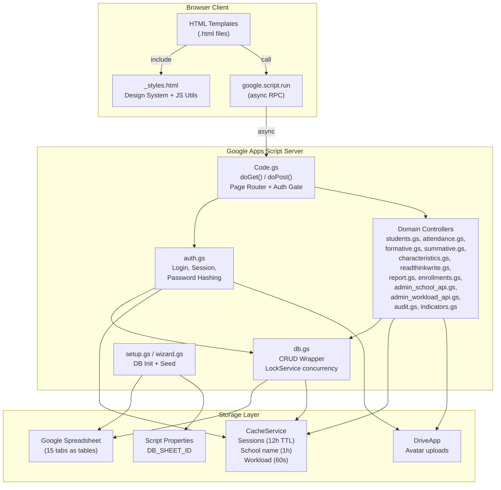

# 2.1 Architecture Design

## 1. System Overview

The **ระบบจัดการ ป.พ.5 ออนไลน์** (PopoWebApp) is a server-rendered web application built on **Google Apps Script (GAS)** that serves as an online grading and student assessment platform for Thai schools. It uses a single **Google Spreadsheet** as its relational database, with each tab acting as a table. There is no build, transpilation, or bundling step — source files inside `src/` are pushed directly to Google Apps Script via `clasp`.

The application follows a **thin-server, thick-template** architecture: the GAS server handles routing, authentication, data access, and business logic, then renders HTML templates with embedded client-side JavaScript. Client pages communicate back to the server through `google.script.run` — an asynchronous RPC mechanism provided by GAS that calls server-side functions from the browser.

All persistent data mutations are protected by **LockService.getDocumentLock()** with a 30-second timeout to prevent concurrent write conflicts, since Google Sheets has no transactional guarantees.

---

## 2. Architecture Diagram



---

## 3. Component Map

### Server-Side Controllers (`.gs`)

| File | Domain | Responsibility |
|---|---|---|
| `Code.gs` | Routing | Entry point: `doGet()` routes by `?page=` param, `doPost()` routes by `?action=` param; authentication gates; page rendering via `HtmlService`; utility functions for class labels |
| `db.gs` | Data Access | Thin CRUD wrapper over Google Sheets: `dbGetAll`, `dbInsert`, `dbUpdate`, `dbDelete`, `dbFind`, `dbFindOne`, `dbDeleteWhere`, `ensureColumns`, `generateId`, `appendAuditLog`; all writes use `LockService` |
| `auth.gs` | Authentication | Password hashing (SHA-256 + UUID salt), session management via `CacheService`, login/logout, token generation, user CRUD, profile editing, avatar upload to Drive |
| `admin_school_api.gs` | Admin - School | School info CRUD, class CRUD, subject CRUD (with multi-class cloning), subject weights CRUD, CSV import for classes and subjects, subject presets (ป.1-3, ป.4-6, ม.1-3), reference lookups |
| `admin_workload_api.gs` | Admin - Workload | Teacher workload aggregation with 60-second cache, teacher's own class list |
| `students.gs` | Students | Student roster CRUD, CSV import with validation |
| `enrollments.gs` | Enrollments | Teacher-class-subject assignment with conflict detection, reassign confirmation, bulk assign (mode A/B) |
| `attendance.gs` | Attendance | Weekly attendance grid data, concurrency-safe save with date/period composite key |
| `formative.gs` | Formative Scoring | Indicator scores grid (คะแนนสะสม/ตัวชี้วัด) read/write |
| `summative.gs` | Summative Scoring | Midterm/final scores with auto-grade computation |
| `characteristics.gs` | Characteristics | 8-trait affective scoring (คุณลักษณะอันพึงประสงค์) with label auto-calc |
| `readthinkwrite.gs` | RTW Scoring | Reading-Thinking-Writing scoring (อ่าน คิดวิเคราะห์ เขียน) with label auto-calc |
| `report.gs` | Reports | Cover page data aggregation for ป.พ.5 PDF export |
| `indicators.gs` | Indicators | Curriculum indicators CRUD per subject |
| `audit.gs` | Audit Log | Admin-only searchable trail of all data changes with date/user/entity filters |
| `setup.gs` | Initialization | Database schema creation (`setupDatabase()`), tab creation from `TAB_SCHEMA`, default admin seeding |
| `wizard.gs` | Setup Wizard | First-run flow: `isFirstRun()`, `wizardCreateDatabase()`, `wizardSaveSchoolInfo()` |
| `testapi.gs` | Testing | API interface exposed only during local testing for remote mock generation |

### Client-Side Views (`.html`)

| File | Page Purpose |
|---|---|
| `_styles.html` | Global design system: CSS variables, component styles, navbar handlers, avatar rendering, toast alerts, loading skeletons |
| `login.html` | Credentials entry form with brand logo, error display, auto-session check |
| `change_password.html` | User-initiated password update (forced on first login for teachers) |
| `dashboard.html` | Main hub: admin setup steps + teacher enrollment pair cards with action links |
| `profile_edit.html` | Profile editing: avatar upload, name change |
| `setup_wizard.html` | First-run step-by-step: create DB → set school info → preset subjects |
| `help.html` | Comprehensive user manual (Thai) |
| `admin_school.html` | School metadata editing |
| `admin_users.html` | User registry: CRUD + CSV import |
| `admin_classes.html` | Classroom definitions: CRUD + CSV import |
| `admin_subjects.html` | Subject catalog: CRUD + CSV import + weight group assignment |
| `admin_indicators.html` | Curriculum indicators per subject |
| `admin_weights.html` | Max point splits configuration per subject |
| `admin_enrollments.html` | Teacher-class-subject scheduler with conflict resolution |
| `admin_workload.html` | Teacher workload analytics dashboard |
| `admin_audit.html` | Activity audit explorer with filters |
| `admin_db_status.html` | Database diagnostics: row counts per tab |
| `class_students.html` | Student roster management per class |
| `class_attendance.html` | Weekly attendance sheet (students × days) |
| `class_formative.html` | Formative indicator scoring grid |
| `class_summative.html` | Midterm/final score entry with auto-grade |
| `class_characteristics.html` | Affective traits 8-point grid |
| `class_readthinkwrite.html` | Reading-Thinking-Writing scoring grid |
| `class_report.html` | Cumulative report dashboard + PDF export |
| `subject_description.html` | Read-only subject syllabus reference |
| `subject_indicators_ref.html` | Read-only indicators list reference |
| `weights_ref.html` | Read-only rating system tables |
| `403.html` | Access denied page |
| `404.html` | Route not found page |

---

## 4. Routing Table

All routes are handled by `doGet(e)` based on the `?page=` query parameter.

| Page Key | Template | Auth Level | Role Required | Description |
|---|---|---|---|---|
| `login` | login.html | None | — | Login form |
| `setup_wizard` | setup_wizard.html | None (first-run) | — | Database setup wizard |
| `dashboard` | dashboard.html | Token | Any | Main hub page |
| `profile_edit` | profile_edit.html | Token | Any | Edit profile & avatar |
| `help` | help.html | Token | Any | User manual |
| `change_password` | change_password.html | Token | Any | Password change form |
| `admin_school` | admin_school.html | Token | Admin | School info management |
| `admin_users` | admin_users.html | Token | Admin | User registry |
| `admin_classes` | admin_classes.html | Token | Admin | Classroom management |
| `admin_subjects` | admin_subjects.html | Token | Admin | Subject catalog |
| `admin_indicators` | admin_indicators.html | Token | Admin | Indicators management |
| `admin_weights` | admin_weights.html | Token | Admin | Weight configuration |
| `admin_enrollments` | admin_enrollments.html | Token | Admin | Enrollment scheduler |
| `admin_workload` | admin_workload.html | Token | Admin | Workload analytics |
| `admin_audit` | admin_audit.html | Token | Admin | Audit trail explorer |
| `admin_db_status` | admin_db_status.html | Token | Admin | Database diagnostics |
| `class_students` | class_students.html | Token | Teacher/Admin | Student roster |
| `class_attendance` | class_attendance.html | Token | Teacher/Admin | Attendance sheet |
| `class_formative` | class_formative.html | Token | Teacher/Admin | Formative scoring |
| `class_summative` | class_summative.html | Token | Teacher/Admin | Summative scoring |
| `class_characteristics` | class_characteristics.html | Token | Teacher/Admin | Characteristics scoring |
| `class_readthinkwrite` | class_readthinkwrite.html | Token | Teacher/Admin | RTW scoring |
| `class_report` | class_report.html | Token | Teacher/Admin | Report & PDF export |
| `weights_ref` | weights_ref.html | Token | Any | Weight reference |
| `subject_description` | subject_description.html | Token | Any | Subject description |
| `subject_indicators_ref` | subject_indicators_ref.html | Token | Any | Indicators reference |
| *(default)* | 404.html | — | — | Not found |

---

## 5. Request Handling

### GET Request Flow (`doGet`)

```
Browser Request (?page=X&token=Y&class_id=Z)
    │
    ▼
doGet(e)
    │
    ├── Extract params: page, token, class_id, subject_id, etc.
    │
    ├── If ?api= → handleTestApi(e) [test-only endpoint]
    │
    ├── If isFirstRun() && page !== 'setup_wizard'
    │       → buildPage('setup_wizard', {})
    │
    ├── getSession(token)
    │       ├── No session → buildPage('login', {error, redirect_page, ...})
    │       └── Valid session → continue
    │
    ├── If page in adminPages[] && session.role !== 'admin'
    │       → buildPage('403', {message})
    │
    ├── If ?action= → handleReadAction(action, params, session)
    │       └── Returns JSON response (get_users_list, etc.)
    │
    └── Switch on page → buildPage(pageName, {session, token, ...})
            │
            └── HtmlService.createTemplateFromFile(pageName)
                    .evaluate()
                    .setTitle(APP_TITLE)
                    .setFaviconUrl(APP_FAVICON_URL)
                    .setXFrameOptionsMode(ALLOWALL)
```

### POST Request Flow (`doPost`)

```
Browser POST (?action=X&token=Y&params...)
    │
    ▼
doPost(e)
    │
    ├── Extract action from e.parameter
    │
    ├── If action === 'login' → handleLogin(e)
    │       └── Verify credentials → create session → redirect
    │
    ├── getSession(token) → if null → return {error: 'Unauthorized'}
    │
    └── Switch on action:
            ├── 'add_enrollment'    → handleAddEnrollment(e, session)
            ├── 'remove_enrollment' → handleRemoveEnrollment(e, session)
            ├── 'confirm_reassign'  → handleConfirmReassign(e, session)
            ├── 'bulk_assign'       → handleBulkAssign(e, session)
            ├── 'add_user'          → serverAddUser(params) [requireAdmin]
            └── 'reset_password'    → serverResetPassword(params) [requireAdmin]
```

### `google.script.run` RPC Pattern (Client → Server)

Client-side JavaScript calls server functions asynchronously:

```javascript
google.script.run
  .withSuccessHandler(onSuccess)
  .withFailureHandler(onError)
  .serverFunctionName(token, param1, param2, ...);
```

The GAS runtime serializes parameters, executes the server function in a sandboxed environment, and returns the result to the success handler. Errors are caught by the failure handler.

### Read Action API (`?action=` parameter)

| Action | Auth | Returns |
|---|---|---|
| `get_users_list` | Admin | `{ users: [...] }` |
| `get_enrollments_data` | Admin | `{ teachers, classes, subjects, enrollments }` |
| `get_teacher_enrollments` | Admin | (with `teacher_user_id` param) |
| `get_all_pairs_matrix` | Admin | `{ rows: [...] }` |
| `get_workload_data` | Admin | Workload aggregation |

---

## 6. Authentication & Session

### Login Flow

```
┌──────────┐    ┌───────────┐    ┌──────────────┐    ┌───────────────┐
│  Browser  │───►│serverLogin│───►│ Find user by │───►│computeHash()  │
│  Login    │    │(username, │    │ username in  │    │SHA-256(password│
│  Form     │    │ password) │    │ Users tab    │    │+ user.salt)   │
└──────────┘    └───────────┘    └──────────────┘    └───────┬───────┘
                                                          │
                                        ┌─────────────────▼──────────────────┐
                                        │  Compare hash with stored hash    │
                                        └──────────┬───────────┬───────────┘
                                                    │           │
                                              Match ✓       No Match ✗
                                                    │           │
                                        ┌───────────▼──┐   ┌────▼─────┐
                                        │generateToken()│   │Return error│
                                        │(40 chars)     │   │ message    │
                                        └───────┬──────┘   └───────────┘
                                                │
                                        ┌───────▼────────────────┐
                                        │ CacheService            │
                                        │ .getScriptCache()       │
                                        │ .put(                   │
                                        │   'session_'+token,     │
                                        │   JSON(sessionData),    │
                                        │   43200  // 12 hours    │
                                        │ )                        │
                                        └───────┬────────────────┘
                                                │
                                        ┌───────▼──────┐
                                        │ Return to     │
                                        │ browser:      │
                                        │ {token,session}│
                                        └───────┬──────┘
                                                │
                                        ┌───────▼──────────────┐
                                        │ Client stores token   │
                                        │ in localStorage as    │
                                        │ 'popo_token'          │
                                        └──────────────────────┘
```

### Session Data Structure

```javascript
{
  user_id: "user_abc123def456",
  username: "admin",
  full_name: "ผู้ดูแลระบบ",
  avatar: "https://drive.google.com/uc?export=view&id=...",
  role: "admin",           // "admin" or "teacher"
  must_change_pwd: false,  // forces password change on next login
  expires_at: 1718000000000  // Unix timestamp + 12h
}
```

### Auth Guards

| Guard | Implementation | Effect |
|---|---|---|
| **Token Required** | `getSession(token)` in every server function | Returns null if expired/missing → client redirects to login |
| **Admin Only** | `requireAdmin(session)` | Throws `'Forbidden: admin only'` if `session.role !== 'admin'` |
| **Enrollment Check** | Filter `dbGetAll('Enrollments')` by `teacher_user_id === session.user_id` | Classroom pages check if teacher is assigned to (class_id, subject_id) |
| **Must Change Password** | `session.must_change_pwd === true` | Client redirects to change_password page |

### Avatar Upload Flow

1. Client reads file as base64 → `serverUploadAvatar(token, base64Data)`
2. Server checks size (max 500KB), extracts MIME type
3. If existing avatar is on Drive, delete old file
4. Create new file via `DriveApp.createFile(blob)`
5. Set sharing to `ANYONE + VIEW`
6. Store URL in Users tab `avatar` column
7. Update session cache with new avatar URL

---

## 7. Data Access Layer (`db.gs`)

### Function Reference

| Function | Lock? | Description |
|---|---|---|
| `dbGetAll(tabName)` | No | Returns all rows as array of objects. Column headers become keys. Date objects are converted to ISO strings. |
| `dbFind(tabName, field, value)` | No | Filters `dbGetAll` result by field=value, returns matching array |
| `dbFindOne(tabName, field, value)` | No | Returns first match or null |
| `dbInsert(tabName, row)` | **Yes** | Acquires lock → reads headers → maps row object to header order → `appendRow` → releases lock |
| `dbUpdate(tabName, idField, idValue, updates)` | **Yes** | Acquires lock → finds row by idField=idValue → updates specified columns → releases lock |
| `dbDelete(tabName, idField, idValue)` | **Yes** | Acquires lock → finds row by idField=idValue → `deleteRow` → releases lock (scans bottom-up) |
| `dbDeleteWhere(tabName, idField, prefix)` | **Yes** | Acquires lock → deletes all rows where `String(row[idField]).startsWith(prefix)` → releases lock (used by test cleanup) |
| `ensureColumns(tabName, headers)` | **Yes** | Acquires lock → checks for missing column headers → appends any missing → releases lock |
| `generateId(prefix)` | No | Returns `{prefix}_{12-char-uuid}` e.g. `user_abc123def456` |
| `appendAuditLog(userId, entity, entityId, oldValue, newValue)` | **Yes** | Inserts into AuditLog tab with timestamp, userId, entity, entityId, JSON.stringify(oldValue), JSON.stringify(newValue) |

### Concurrency Pattern

All mutations use this pattern:

```javascript
var lock = LockService.getDocumentLock();
if (!lock.tryLock(30000)) throw new Error('Could not acquire lock');
try {
  // ... read data, compute, write ...
} finally {
  lock.releaseLock();
}
```

- **Timeout**: 30 seconds (`tryLock(30000)`)
- **Scope**: Document-level lock (only one writer at a time across all tabs)
- **Test isolation**: Single Playwright worker (`workers: 1`) to avoid lock conflicts

---

## 8. Caching Strategy

| Cache Key | Service | TTL | Purpose | Invalidation |
|---|---|---|---|---|
| `session_{token}` | `CacheService.getScriptCache()` | 12 hours (43200s) | User session data | On logout, password change, profile edit |
| `school_name` | `CacheService.getScriptCache()` | 1 hour (3600s) | School name display | On `serverSaveSchoolInfo()` |
| `workload_v1` | `CacheService.getScriptCache()` | 60 seconds | Teacher workload aggregation | On any enrollment change (add/remove/reassign/bulk) |

The `CacheService.getScriptCache()` is scoped per script deployment. It has a maximum value size of 100KB per key and enforces the TTL strictly.

---

## 9. Deployment Pipeline

### Configuration (`.clasp.json`)

```json
{
  "scriptId": "1iue17qfpnH8cxbZqt0Wq3QRX40bbf9qpvLBQO8nHcC3uk6AYQKNdZLah",
  "rootDir": "src"
}
```

- `scriptId`: Links to the Google Apps Script project
- `rootDir`: Maps the `src/` directory to the GAS project root, so `src/Code.gs` becomes `Code.gs` in GAS

### Deployment Commands

```bash
# Push source files to Google Apps Script
npx clasp push

# Redeploy production (keeps the URL stable)
npx clasp redeploy AKfycbxoOgEwrVOCxFvZEQahEiCvfB29gu5rQ8z1kplcMjipkzSBrZe6GrbkGHF4VwO8M4mA --description "Release v1.x.x"
```

### Production URL

```
https://script.google.com/macros/s/AKfycbxoOgEwrVOCxFvZEQahEiCvfB29gu5rQ8z1kplcMjipkzSBrZe6GrbkGHF4VwO8M4mA/exec
```

This URL remains constant across redeployments because it targets the stable deployment ID.

### Database Configuration

- `DB_SHEET_ID` is stored in **Script Properties** (`PropertiesService.getScriptProperties()`)
- Set during `setupDatabase()` (first-run wizard) or manually via Apps Script editor
- All database operations reference this ID to open the spreadsheet: `SpreadsheetApp.openById(id)`

---

## 10. Test Architecture

### Playwright Configuration (`playwright.config.ts`)

- **Workers**: `1` (single worker to avoid LockService conflicts in Google Sheets)
- **Timeout**: `60,000ms` (accommodates Spreadsheet API latency)
- **Projects**:
  - `setup`: Runs `tests/auth.setup.ts` once to cache credentials in `tests/.auth/auth.json`
  - `chromium`: Main test project using cached storage state

### Iframe Sandbox Traversal

Google Apps Script renders web apps inside nested iframes. Tests must traverse:

```
Parent Window
  └── #sandboxFrame (middle iframe)
        └── #userHtmlFrame (inner iframe)
```

Custom test wrapper (`tests/helpers/custom-test.ts`):

```typescript
const frameLocator = page.frameLocator('#sandboxFrame').frameLocator('#userHtmlFrame');
```

All Playwright locators are proxied through these frames to interact with the actual page content.

### Test Data Isolation

- All test-generated records use IDs prefixed with `test_` (e.g., `test_teacher_math`, `test_class_m1_1`)
- The test API (`testapi.gs`) strictly validates the `test_` prefix before any modifications
- `cleanupTestData()` runs at the end of each test spec, deleting all `test_` records across all sheets

### Seed and Cleanup

- `tests/helpers/seed.ts`: Provides functions to create test users, classes, subjects, enrollments, and students with `test_` prefixed IDs
- Cleanup calls `dbDeleteWhere` on all tabs with the `test_` prefix filter

---

## 11. GAS Constraints & Quirks

| Constraint | Impact | Workaround |
|---|---|---|
| **Caja Sanitizer** | Strips base64 encoding from inline `<script>` tags, causing avatar/image loads to fail when set via `document.write()` | Images are set dynamically via client-side JS (`initNavbarAvatar()`) or loaded via external HTTP URLs (Raw GitHub URLs) |
| **Type Coercion** | Google Sheets returns numeric values as raw `Number` types (e.g., `1` instead of `"1"` for section numbers) | All comparisons use `String()` wrapping: `String(row.section) === '1'` |
| **Single-threaded Writes** | `LockService.getDocumentLock()` enforces only one mutation at a time | Playwright tests use `workers: 1`; production relies on 30-second tryLock timeout |
| **No SPA Routing** | Each navigation is a full server render; no client-side URL routing | `google.script.run` calls `getPageHtml()` / `getPageHtmlWithParams()` → client replaces page content via `document.write()` |
| **Template-only Rendering** | No build/bundle step; all HTML/CSS/JS is raw in `.html` templates | `<?!= include('_styles') ?>` injects global styles; `<?!= JSON.stringify(data) ?>` injects server data into client scripts |
| **Cache Size Limits** | `CacheService.getScriptCache()` caps values at ~100KB per key | Session data kept minimal (6 fields); workload cache is 60s TTL to stay fresh |
| **No Native PDF** | GAS cannot directly render HTML to PDF | `report.gs` copies data into a pre-formatted Google Sheet template for print-to-PDF |
| **X-Frame-Options** | GAS sets `X-Frame-Options: ALLOWALL` on all pages | Allows embedding but also third-party iframes; tests must traverse nested iframes |